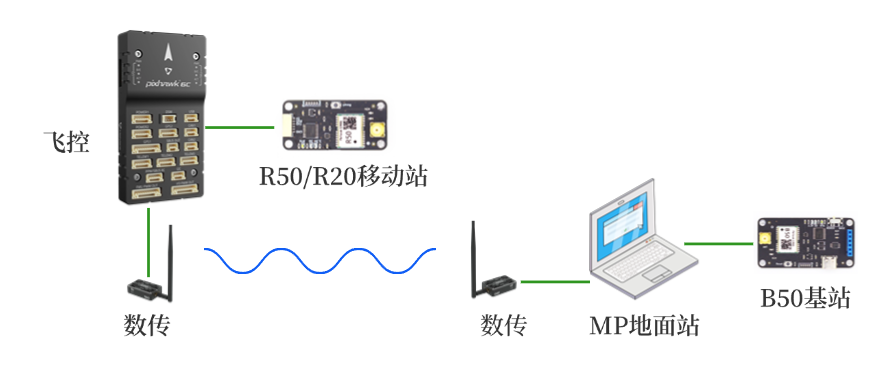

# B50板卡手册

## 1	简介
&emsp;&emsp;B50模块为双频三系统高精度RTK模块，支持北斗3代，GPS以及伽利略导航系统。 
&emsp;&emsp;B50模块可工作在Base基站或者Rover移动站模式，通过板上拨动开关选择工作模式。 
&emsp;&emsp;B50支持蓝牙模块直插，蓝牙模块支持SPP串口协议，可连接PC，手机，平板等设备，方便使用。 

主要指标如下图所示。

|参数|性能指标|
|--|--|
|GNSS 接收频点|GPS/QZSS: L1C/A, L5 BDS: B1I, B2a Galileo: E1, E5a|
|UART 波特率|115200  8N1|
|数据更新率 (Hz)|1Hz|
|定位精度|GNSS 3D 2.5m CEP 50 D-GNSS <1.0m CEP 50 RTK 1.5cm+1ppm(水平) 6.5cm+1ppm(垂直)|
|接口|USB Type C 供电兼转UART 蓝牙SPP（选配） SMA 母 GNSS|
|协议|NMEA 0183 协议 4.00/4.10 版本 RTCM 3.0/3.2/ MSM4 (收发) MSM7 (仅收)|
|尺寸|58mm X 30mm| 

 
## 2	接口说明
 
{: .center-image }

- SMA为天线接口，板上已设计3.3V供电电路，建议使用四臂螺旋天线或碟形天线，请注意天线需支持L1 L5频段。
指示灯用来指示工作状态。
- Base/Rover选择开关用来选择工作模式，请先选择工作模式，再上电。
- USB接口为供电兼转串口，默认波特率115200, 8N1，可直连PC上USB接口，连接后设备管理器中会新增一个串口，通过此串口可和B50通讯，接收NMEA定位数据（Rover模式下）或RTCM差分数据（Base模式下）。如果通过蓝牙连接，可连接充电宝或其它5V电源供电。
- 蓝牙模块：B50可直插蓝牙模块，默认型号为广州汇承HC-04，此蓝牙模块支持SPP V2.1协议，连接后可在上位机上模拟2个标准串口，默认波特率115200, 8N1，同时模块有工作指示灯指示连接状态。详细资料请查阅HC-04手册。

{: .center-image }

!!! note "COM端口号"
    &emsp;&emsp;上图中端口号COM27，COM28为PC系统自动分配，每台PC上并不相同，具体端口号请在蓝牙配对成功后在PC设备管理器中查看。模块数据具体通过哪个COM发送请通过串口助手等工具查看。

&emsp;&emsp;蓝牙设备名称：B50， PIN码：1234  
&emsp;&emsp;B50的USB串口和蓝牙串口可同时接收，发送数据，请注意不要同时发送数据给B50，否则数据会相互干扰发生错误。 

!!! note "蓝牙连接"
    &emsp;&emsp;蓝牙设备配对成功后并未连接，此时工作指示灯闪，需要在PC或手机上使用串口助手等软件工具并打开蓝牙串口才真正连接，此时工作指示灯转为常亮。

&emsp;&emsp;B50板上设计了指示灯，以显示当前定位模式，具体定义如下：
 
| 模式   | 3D 绿色          | RTK 白色         | 定位状态                          |
|--------|-------------------|------------------|-----------------------------------|
| Rover  | 灭 亮 亮 亮 | 灭 灭 闪 亮 | 未定位 3D单点定位 RTK浮动解 RTK固定解 |
| Base   | 闪 亮          | 灭 灭         | 基站坐标计算中 基站坐标已获取   |
 
 
## 3	Base模式
&emsp;&emsp;将板上的拨动开关拨到右侧， 则进入Base基站模式。 
&emsp;&emsp;Base模式上电后会自动进入求坐标平均值模式（Survey In）并持续3分钟，期间绿色指示灯闪亮，数传模块无数据发送。3分钟后B50自动获取到一个固定坐标，并开始输出RTCM差分数据：1005 (0.1Hz)，1074(1Hz)，1094(1Hz)，1124(1Hz)，同时绿色指示灯常亮。此时其它移动站Rover可使用此差分数据进行RTK解算。 
&emsp;&emsp;Base的无线数传天线架设高度尽量高，和Rover之间尽量无遮挡，建筑物等遮挡将显著减少通讯距离。 
&emsp;&emsp;Base的GNSS天线位置请尽量选择开阔无遮挡的环境，并且架设高度尽量高。如果周围遮挡较多，可能会出现3分钟后B50仍然无法获得固定坐标，此时绿色指示灯仍闪亮，坐标持续计算中，没有RTCM数据发出。 
&emsp;&emsp;B50在大多数情况下可以允许有部分遮挡，这是三系统双频模块的优点，但是最好不要超过三分之一的可视天空面积。 

!!! note "基站坐标"
    &emsp;&emsp;通过求坐标平均值方式获取的基站坐标并不是真正意义的精准坐标（厘米级），即使天线位置固定不动，每次重新上电或复位后获取的坐标会分布在半径约1.5米的圆内。移动站Rover在RTK Fix的状态下和基站Base的相对位置总是精确的，因此Base的绝对位置不准会导致移动站Rover绝对位置不准，但两者的偏差是一致的。在无人机，无人船等应用中如果只要求相对位置准确（如自动返航功能等），则可以不要求Base基站绝对位置准确。
 
!!! note "长时间运行"
    &emsp;&emsp;受技术规格及性能限制，B50 Base模式并不适合长时间连续运行（24小时以上），或者对稳定性要求高的行业应用，我们对此类情况下的性能不做保证。如需长时间运行，请选择B80.

 &emsp;&emsp;无人机应用中B50需连接地面站PC，飞控需连接R50/R20移动端使用，连接示意图如下。

 {: .center-image }
 
## 4	Rover模式
&emsp;&emsp;将板上的拨动开关拨到左侧， 则进入Rover移动站模式。 
&emsp;&emsp;Rover模式上电后会立刻开始搜索卫星尝试定位，3D指示灯灭，串口有NMEA数据输出，无RTCM消息。正常情况下上电1分钟左右定位成功，3D指示灯常亮。 
&emsp;&emsp;Rover模式下如需RTK精确定位，需要将基站差分数据通过串口发送给B50，B50会自动解算。基站差分数据可以来自自建基站（另一台B50 Base模式），也可以来自第三方的CORS服务商，例如千寻位置，六分科技，中移位置等。此时需要在Base和Rover之间有数据链路进行通讯。第三方的CORS服务商通常提供互联网方式访问，可选NTRIP协议或SDK方式。自建基站通常采用数传电台，也可视实际传输距离考虑其它通讯方式，通讯带宽不能低于19200波特率。 
&emsp;&emsp;和Base模式相同，Rover模式下天线尽量保持在无遮挡环境，通常Rover会处在运动中，如果进入遮挡较多的地点，可能会退出RTK Fix状态。 
&emsp;&emsp; Rover模式下可使用上位机软件对B50进行参数配置，连接Base基站等操作，具体方法请查阅上位机软件使用说明。 
 
&emsp;前往淘宝店选购：[淘宝店铺](https://shop571754683.taobao.com/){:target="_blank"}
&emsp;&emsp;&emsp;&emsp;&emsp;&emsp;&emsp;&emsp;&emsp;
前往B站查看教程：[Bilibili](https://space.bilibili.com/1105134755){:target="_blank"} 
  **欢迎扫码访问**  
