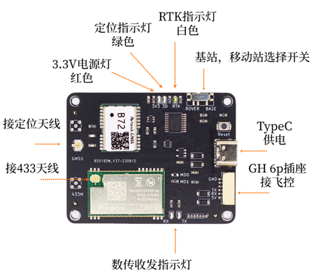

# B72板卡手册V1.3

## 1	简介
&emsp;&emsp;B72模块为双频三系统高精度RTK模块，支持北斗3代，GPS以及伽利略导航系统。 
&emsp;&emsp;B72模块可工作在Base基站或者Rover移动站模式，通过板上拨动开关选择工作模式。 
&emsp;&emsp;支持千寻位置，六分科技，中移等第三方CORS服务。 
&emsp;&emsp;B72集成了410-490MHz无线数传模块，可直接从Base基站向Rover移动站发送RTCM数据，支持1对1模式和1对多模式，方便组网使用。 
主要指标如下图所示。

|参数|性能指标|
|--|--|
|GNSS 接收频点|GPS: L1C/A, L5 BDS: B1I, B2a Galileo: E1, E5a|
|UART 波特率|115200 8N1|
|数据更新率 (Hz)|无人机版5Hz，标准版1Hz|
|定位精度|GNSS 3D 2.5m CEP 50 D-GNSS <1.0m CEP 50 RTK 1.5cm+1ppm(水平) 6.5cm+1ppm(垂直)|
|接口|USB Type C 供电口 GH1.25mm 6Pin插座 MMCX母 GNSS 数传（选配） IPEX 1代 GNSS 数传|
|协议|NMEA 0183 协议 4.10 版本 RTCM 3.0/3.2/ MSM4 (收发) MSM7 (仅收)|
|尺寸|58mm X 45mm|
|无线数传频段|410~490MHz，81 个信道，1MHz 步进 出厂默认443MHz|
|无线数传发射功率|10~21dBm，最大 126mW|
|无线数传距离|3Km（晴朗天气，无遮挡，天线距地面2m）|
|工作电压|4.0V~5.5V （不可超过5.5V）|
|工作电流|Base模式最大275mA Rover模式最大220mA| 

 
## 2	接口说明

{: .center-image }
 
- GNSS天线接口，板上已设计3.3V供电电路，建议使用四臂螺旋天线或碟形天线，请注意天线需支持L1 L5频段。
- 数传模块天线接口，外接443MHz天线。
- 工作指示灯用来指示工作状态。
- Base/Rover选择开关用来选择工作模式，请先选择工作模式，再上电。上电后如拨动开关切换工作模式需按复位按钮重新启动。
- USB接口为供电口，在两种模式下都可给B72供电。
- GH1.25插座为供电，UART接口，在Rover模式下接收差分数据，发送NMEA数据，在Base模式下发送差分数据。引脚定义如下。
 
   

   |引脚|定义|电平|
  |--|--|--|
  |1|VCC|MAX 5.3V|
  |2|RXD收|3.3V|
  |3|TXD发|3.3V|
  |4|NC| - |
  |5|NC| - |
  |6|GND|GND|  
 
- B72板上设计了指示灯，以显示当前定位模式，具体定义如下：
 
| 模式   | 3D 绿色          | RTK 白色         | 定位状态                          |
|--------|-------------------|------------------|-----------------------------------|
| Rover  | 灭 亮 亮 亮 | 灭 灭 闪 亮 | 未定位 3D单点定位 RTK浮动解 RTK固定解 |
| Base   | 闪 亮          | 灭 灭         | 基站坐标计算中 基站坐标已获取   |

 
## 3	Base模式
&emsp;&emsp;将板上的拨动开关拨到右侧， 则进入Base基站模式。 
&emsp;&emsp;Base模式上电后会自动进入求坐标平均值模式（Survey In）并持续3分钟，期间绿色指示灯闪亮，数传模块无数据发送。3分钟后B72自动获取到一个固定坐标，并开始输出RTCM差分数据：1005 (0.1Hz)，1074(1Hz)，1094(1Hz)，1124(1Hz)，同时绿色指示灯常亮。此时其它B72移动站Rover可接收此差分数据进行RTK解算。 
&emsp;&emsp;Base的无线数传天线架设高度尽量高，和Rover之间尽量无遮挡，建筑物等遮挡将显著减少通讯距离。 
&emsp;&emsp;Base的GNSS天线位置请尽量选择开阔无遮挡的环境，并且架设高度尽量高。如果周围遮挡较多，可能会出现3分钟后B72仍然无法获得固定坐标，此时绿色指示灯仍闪亮，坐标持续计算中，没有RTCM数据发出。 
&emsp;&emsp;B72在大多数情况下可以允许有部分遮挡，这是三系统双频模块的优点，但是最好不要超过三分之一的可视天空面积。 

!!! note "基站坐标"
    &emsp;&emsp;通过求坐标平均值方式获取的基站坐标并不是真正意义的精准坐标（厘米级），即使天线位置固定不动，每次重新上电或复位后获取的坐标会分布在半径约1.5米的圆内。移动站Rover在RTK Fix的状态下和基站Base的相对位置总是精确的，因此Base的绝对位置不准会导致移动站Rover绝对位置不准，但两者的偏差是一致的。在无人机，无人船等应用中如果只要求相对位置准确（如自动返航功能等），则可以不要求Base基站绝对位置准确。

&emsp;&emsp;在Base模式下GH1.25接口会输出和数传模块相同的差分数据。

!!! note "长时间运行"
    &emsp;&emsp;受技术规格及性能限制，B72 Base模式并不适合长时间连续运行（24小时以上），或者对稳定性要求高的行业应用，我们对此类情况下的性能不做保证。如需长时间运行，请选择B80.
 
## 4	Rover模式
&emsp;&emsp;将板上的拨动开关拨到左侧， 则进入Rover移动站模式。 
&emsp;&emsp;Rover模式上电后会立刻开始搜索卫星尝试定位，3D指示灯灭，串口有NMEA数据输出，无RTCM消息。正常情况下上电1分钟左右定位成功，3D指示灯常亮。 
&emsp;&emsp;Rover模式下如需RTK精确定位，可使用自建基站，也可使用千寻，六分等第三方CORS服务，下面分别说明。 
&emsp;&emsp;自建基站方式，需提前架设好另一台B72在Base模式，并确认绿色指示灯已处于常亮状态。此时Rover会自动接收RTCM差分数据并解算。 
&emsp;&emsp;使用第三方CORS服务时，通常做法是使用USB转TTL串口连接到PC，在PC上运行上位机软件，在上位机软件中输入账号密码连接第三方服务。连接成功后，差分数据会自动发送到B72，可在上位机中查看RTK状态。此方法也常用来验证CORS账号是否有效，B72是否正常等。 
&emsp;&emsp;如果是其它嵌入式应用，则用户需自行连接第三方CORS服务，并将接收到的差分数据透明传输到B72的UART RXD，如果差分数据正常，可通过解析GNGGA语句中的定位状态来判断定位状态。也可以通过板上白色指示灯判断定位状态。 
&emsp;&emsp;和Base模式相同，Rover模式下天线尽量保持在无遮挡环境，通常Rover会处在运动中，如果进入遮挡较多的地点，可能会退出RTK Fix状态。 
&emsp;&emsp;Rover移动站分为标准版和无人机版。标准版NMEA数据更新率为1Hz，适合一般地面速度较慢设备使用。无人机版NMEA数据更新率为5Hz，适合Pix飞控或者其它速度较快设备使用。两个版本定位精度没有差别。 
&emsp;&emsp;Rover移动站模式下GH1.25接口通过TXD发送NMEA语句。 

!!! note "RTCM来源唯一性"
    &emsp;&emsp;Rover移动端接收的RTCM数据必须唯一，否则将无法进行RTK解算。举例来说如果当前正在使用B72自建基站的RTCM数据，此时需要切换到第三方CORS服务，那么必须先关掉B72自建基站，再连接第三方CORS服务。反之同样，需要先断开第三方CORS服务，再开启B72自建基站。 
 
## 5	组网
&emsp;&emsp;B72上集成的无线数传模块采用410-490MHz自由频段，单向发送，广播模式。因此一个B72 Base基站可支持多个覆盖范围内的B72 Rover移动站，Rover移动站的数量没有限制。 
 
更多说明点击[通用注意事项](../general/general.md)  

## 6	数传模块
&emsp;&emsp;集成数传模块最大126mW发射功率，标配为5cm胶棒天线，增益3DBi。实际传输距离受使用环境及遮挡物情况而定。如实地测试无法达到所需的传输距离，可以使用外置大功率无线数传，具体请参考“数传扩展方案”文件或联系我们。

!!! warning "数传天线高度"
    使用时胶棒天线不要直接放在地面上，应尽量架高，距离地面2米的距离。放在地面上将导致覆盖距离严重缩短。

## 7	常见问题及解决方法
### 1.	供电
&emsp;&emsp;B72作为基站时，可用充电宝通过Type C接口供电。 
&emsp;&emsp;B72作为移动站时，Pixhawk飞控通常可以通过GH1.25 6pin插座提供1.5A的供电能力，如果飞控无法支持250mA的电流，也可通过Type C接口或分电板供电。 
### 2.	天线
&emsp;&emsp;B72的GNSS天线要求支持L1，L5的双频天线，如果工作不正常，请检查天线是否支持L1，L5双频段，尤其是客户自己配备的天线。推荐在购买B72时一同购买配套的四臂螺旋天线。 
&emsp;&emsp;如果天线确认无误，请检查天线周边是否有遮挡。通常天线架设在窗边或者半边高楼遮挡的环境会导致B72基站无法获取位置，没有RTCM数据发出，B72移动站会一直处于3D定位状态，无法进入RTK解算。 
### 3.	数传模块
&emsp;&emsp;当B72基站和B72移动站的距离为几米到十几米时，移动站数传模块的接收功率可能会过高引起阻塞，导致无法接收RTCM差分数据，或者时断时续。这种情况下可取下移动站数传模块的接收天线，基站端天线不动，检查是否能正常工作。在远距离工作时，请将两边的天线都正常安装，以保证通讯距离最大。 
&emsp;&emsp;数传模块默认工作在443Mhz频点，如果出现RTK fix时断时续，有可能在使用场地附近有其他443频点的无线设备引起干扰。可换一个场地再测试，排除干扰问题。如果确认场地有干扰但仍需使用，可联系我们更改数传模块的工作频点。 
 

&emsp;前往淘宝店选购：[淘宝店铺](https://shop571754683.taobao.com/){:target="_blank"}
&emsp;&emsp;&emsp;&emsp;&emsp;&emsp;&emsp;&emsp;&emsp;
前往B站查看教程：[Bilibili](https://space.bilibili.com/1105134755){:target="_blank"} 
  **欢迎扫码访问**  
