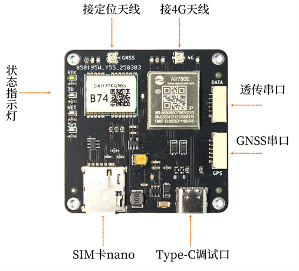
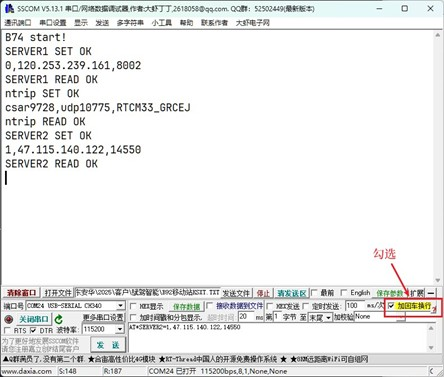

# B74板卡手册

## 1.简介  
&emsp;&emsp;B74模块为双频三系统高精度RTK定位模块，支持北斗，GPS，伽利略导航系统。<br>
&emsp;&emsp;B74集成了全网通4G模块，内置NTRIP客户端，配置CORS账号后可直接连接千寻位置，六分科技，中移等第三方CORS服务，获取差分数据后进行RTK高精度定位。账号信息自动保存，上电自动连接。<br>
&emsp;&emsp;B74提供一个TTL UART透传接口，支持TCP/UDP协议，可将串口数据透传到云端服务器。在无人机/无人车应用中，可作为地面站和飞控的数传接口，即4G数传，在4G信号覆盖良好的地区，可以做到不限距离的遥测/遥控。<br>

!!! note "注意事项"

    1. 用户需自备SIM卡及相应的流量包，以保证正常上网。
    2. 用户需自备有效的CORS账号，以保证正常获取差分数据。
    3. 用户使用TTL透传数据需自备云端服务器IP地址（域名）及端口号，各种数据后台的服务器软件和应用控制软件开发技术众多，实现方式也非常多，请自行使用熟悉擅长的方式实现，我们不提供服务端技术开发支持服务，可以配合联调测试，请理解。<br>
    4. 如对板卡参数配置不熟悉，可在发货前提供CORS账号及云端服务器IP/端口号，我们可帮助进行参数配置并联网测试验证。所有参数配置后会自动保存，板卡上电后自动连接。到货后只需用户插入SIM卡即可正常工作。
 
主要指标如下图所示。

|参数|性能指标|
|--|--|
|GNSS 接收频点|GPS: L1/L5<br>BDS: B1I/B2a<br>Galileo: E1/E5a|
|GNSS UART 波特率|默认115200  8N1|
|数据更新率 (Hz)|5Hz|
|GNSS UART协议|NMEA 0183 协议<br>RTCM 3.0/3.2/ MSM4 (收发)|
|定位精度|GNSS 3D 2.5m CEP 50<br>D-GNSS <1.0m CEP 50<br>RTK 1cm+1ppm(水平)<br>3cm+1ppm(垂直)|
|网络频段|LTE-FDD: B1/B3/B5/B8<br>LTE-TDD: B34/B38/B39/B40/B41<br>Category: CAT1|
|透传UART 波特率|默认115200  8N1|
|透传网络协议|TCP/UDP 二选一|
|CORS访问|NTRIP协议|
|接口|Type-C 供电/调试<br>2个GH1.25 6Pin插座<br>4G天线 IPEX 1代<br>GNSS天线   IPEX 1代<br>SIM卡 Nano卡|
|尺寸|50mm X 50mm X 6mm|
|工作电压|4.5V~20V GH1.25mm 6Pin插座<br>Type-C 5V|
|工作电流|5V下平均电流 90mA<br>峰值电流 100mA|

## 2. 接口说明
 
 {: .center-image }

- SIM卡插座使用nano卡，即主流的智能手机卡。访问CORS时每小时流量消耗为7M字节左右，如使用物联网卡，需根据自己的使用时长选择合适的流量套餐，避免流量超出无法上网。
- GNSS天线接口，板上已设计3.3V供电电路，建议使用四臂螺旋天线或碟形天线，请注意天线需支持相应的频段。
- 4G全网通模块天线接口，外接4G天线。
- 状态指示灯从下至上分别为3.3V 红色，Net 网络/数据指示灯 蓝色，3D单点定位 绿色，RTK Fix 白色。
- Type-C接口为供电加调试接口，主要用作出厂前下载程序，检测使用。用户可用来给板卡供电，使用标准的充电宝或充电器即可。紧急情况下也可使用安卓手机反向供电，使用两端都为Type-C的充电线连接手机和板卡即可。
- GH1.25 6pin插座为供电及UART接口，共有2个，分别为透传串口，GNSS串口。引脚定义如下。
 
   
 
  |引脚|定义|电平|
 |--|--|--|
 |1|VCC|MAX 5.3V|
 |2|RXD收|3.3V|
 |3|TXD发|3.3V|
 |4|NC| - |
 |5|NC| - |
 |6|GND|GND|  

## 3.工作流程

!!! note "注意"
    上电前请连接好GPS天线，4G天线，插入SIM卡，提前配置好CORS账号及透传数据的服务器IP/端口号，配置方法见后。

&emsp;&emsp;模块上电后会开始搜索卫星尝试定位，GNSS口有NMEA数据输出。正常情况下上电1分钟左右3D定位成功，此时板上3D指示灯会亮起。同时4G模块会尝试连接网络，网络连接成功后Net网络指示灯会亮起。而后连接透传服务器和CORS服务器，当有差分数据或者透传数据传输时Net灯会闪。<br>
&emsp;&emsp;模块在3D定位后会自动发送一个位置信息给CORS服务器，服务器收到位置信息后会开始下发差分数据，收到差分数据后模块自动开始RTK解算，正常情况下很快进入RTK fix状态，板上RTK指示灯会亮起。大多数CORS服务需要提供位置信息后才能下发差分数据，也就是需要等待板上3D指示灯亮起后才能收到差分数据。<br>
&emsp;&emsp;GNSS天线尽量保持在无遮挡环境，通常Rover会处在运动中，如果进入遮挡较多的地点，可能会退出RTK Fix状态。<br>
&emsp;&emsp;GNSS接口默认输出GGA，RMC消息，默认刷新率5Hz。如需其它消息或刷新率请联系我们。<br>
&emsp;&emsp;数据透传接口可连接任何UART（3.3V）接口，例如飞控的数传接口，从而建立双向通讯，实现地面站和飞控的远程连接。数据透传接口和CORS访问完全独立，不会互相影响。
 
## 4. 4G模块配置及调试

&emsp;&emsp;4G模块的配置使用AT命令方式，用户需要配置CORS服务器及透传服务器的相关参数，请使用USB转TTL调试工具连接B74板卡的透传串口，然后使用串口助手发送相关AT命令。<br>
&emsp;&emsp;串口助手推荐使用sscom，波特率115200 8 N 1，配置前请插入SIM卡，否则配置成功后也无法连接服务器。

!!! warning "警告"
    1. 所有配置命令必须为纯英文字符，配置时请确认输入法为英文，中文输入法输入的字符会导致错误。
    2. 所有的AT命令必须以‘回车换行’结束。在sscom中可勾选右下角的“加回车换行”自动添加。

 {: .center-image }

### 1.	配置CORS服务器
```bash
命令格式：
配置：AT*SERVER1=0,IP,port
查询：AT*SERVER1?

返回：
SERVER1 SET OK

参数说明:
<IP>：服务器地址，域名或IP，推荐用 IP
<port>：服务器端口
举例：
AT*SERVER1=0,120.253.239.161,8002   //配置中移动CORS的IP+端口，
```
### 2.	配置用户名、密码、挂载点
```bash
命令格式：
配置：AT*NTRIP=username,password,mountpoint
查询：AT*NTRIP?

返回：
ntrip SET OK

参数说明:
<username>：用户名；
<password>：密码；
<mountpoint>：挂载点；

举例：
AT*NTRIP= cqnf3706,ckj78383,RTCM33_GRCEJ
```
### 3.	配置串口透传服务器IP/端口号
```bash
命令格式：
配置：AT*SERVER2=connect type,IP,port
查询：AT*SERVER2?

返回：
SERVER2 SET OK

参数说明:
<connect type>: 协议类型，0为TCP，1为UDP
<IP>：服务器地址，域名或IP，推荐用 IP
<port>：服务器端口
举例：
AT*SERVER2=0,88.88.88.88,5760
//连接服务器88.88.88.88的5760端口，TCP协议
AT*SERVER2=1,88.88.88.88,14550
//连接远程MissionPlaner或QGC地面站，地面站软件默认使用UDP协议，默认端口号为14550
```
&emsp;&emsp;如果正常配置完成后无法RTK定位，或者无法透传串口数据到后台服务器，则配置中某些参数有错，请联系我们提供远程调试服务。<br>

!!! note "注意"
    所有AT命令的参数部分，用户需自行保证正确无误，板卡无法判断是否正确。建议配置完成后立即使用查询命令核对参数是否正确写入。

## 6.常见问题及注意事项
### 1.	供电
&emsp;&emsp;B74可通过2个GH1.25 6pin插座中的任何一个提供5V-20V供电，Pixhawk飞控通常可以通过GH1.25 6pin插座提供5V 1.5A的供电能力，推荐直接使用飞控供电。2个GH1.25 6pin插座中的VCC为直连无隔离，严禁同时连接不同电压的电源。<br>
&emsp;&emsp;Type-C接口也可供电，推荐在单独测试时使用。请注意Type-C接口只能接受5V供电，超出5V可能会烧板造成硬件损坏。因此请使用单独的充电宝供电，严禁同一充电宝同时给其它手机充电，因手机使用快充协议，充电宝输出电压为9V或12V。
Type-C接口和2个GH1.25 6pin插座的VCC有隔离，但安全起见请勿同时供电。
### 2.GNSS天线
&emsp;&emsp;B74的GNSS天线要求支持相应的频段，通常情况下要求全频天线或双频天线。注意如果天线不支持某一频段，则B74也无法接收对应频段的信号。<br>
&emsp;&emsp;如果天线确认无误，请检查天线周边是否有遮挡。通常天线架设在窗边或者半边高楼遮挡的环境会导致B74一直处于3D定位状态，无法进入RTK fix，即使NTRIP服务器访问正常并已收到差分数据。因此初次测试时请尽量选择开阔环境，先确认板卡工作正常。
### 3.	4G天线
&emsp;&emsp;B74配件中附带2种4G天线，FPC天线（小和轻）和胶棒天线（大和重）。FPC天线增益较低，胶棒天线增益高，用户可以根据4G信号的强度选择使用。大多数情况下FPC天线都能胜任。<br>
<br>
<br>
&emsp;前往淘宝店选购：[淘宝店铺](https://shop571754683.taobao.com/){:target="_blank"}
&emsp;&emsp;&emsp;&emsp;&emsp;&emsp;&emsp;&emsp;&emsp;
前往B站查看教程：[Bilibili](https://space.bilibili.com/1105134755){:target="_blank"}<br>
  **欢迎扫码访问**  
