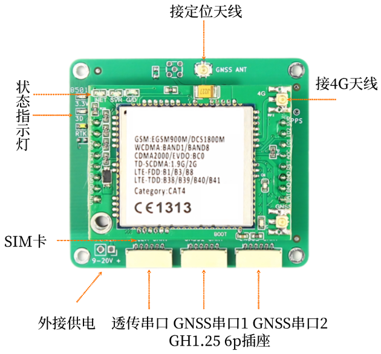

# B84板卡手册V1.0

&emsp;&emsp;B84与B94的绝大部分功能都相同，主要的区别是B84为**单定位**，B94为**定位+定向**，且B84支持北斗系统的**所有频段**。这里只给出B84的指标参数差异和图片，其它内容请移步B94页面。

| 区别 | B84 | B94 |
|---------|-----------------|---------------|
| GNSS 接收频点     | GPS: L1/L2/L5 BDS: B1I/B1c/B2I/B2a/B3I GLONASS: L1/L2 Galileo: E1/E5a/E5b QZSS: L1/L2/L5 | GPS: L1/L2/L5 BDS: B1I/B2I/B3I GLONASS: L1/L2 Galileo: E1/E5a/E5b QZSS: L1/L2/L5 |
|双天线定向 Heading|不支持|支持|

{: .center-image }

&emsp;前往淘宝店选购：[淘宝店铺](https://shop571754683.taobao.com/){:target="_blank"}
&emsp;&emsp;&emsp;&emsp;&emsp;&emsp;&emsp;&emsp;&emsp;
前往B站查看教程：[Bilibili](https://space.bilibili.com/1105134755){:target="_blank"} 
  **欢迎扫码访问**  
