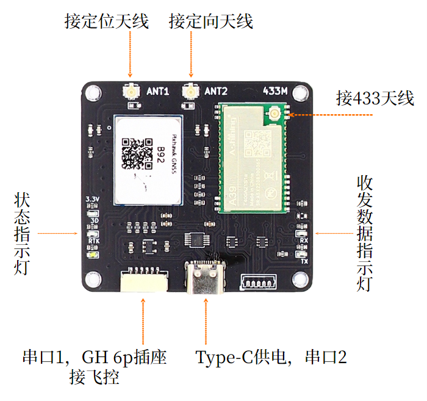

# B92板卡手册

&emsp;点击链接观看演示视频：[B92演示视频](https://www.bilibili.com/video/BV1jz4y1h71j){:target="_blank"}

&emsp;点击链接观看视频：[B92快速安装](https://www.bilibili.com/video/BV1m3Exz1EH8){:target="_blank"}

## 1	简介
&emsp;&emsp;B92模块为三频全系统高精度RTK定位定向模块，支持北斗，GPS，Glonass，伽利略以及QZSS导航系统。<br>
&emsp;&emsp;B92模块可工作在Base基站或者Rover移动站模式，通过UART接口配置命令选择工作模式，配置命令可保存，再次上电可自动加载保存的工作模式及参数。<br>
&emsp;&emsp;支持千寻位置，六分科技，中移等第三方CORS服务。<br>
&emsp;&emsp;B92集成了410-490MHz无线数传模块，可直接从Base基站向Rover移动站发送RTCM数据，支持1对1模式和1对多模式，方便组网使用。<br>
主要指标如下图所示。

|参数|性能指标|
|--|--|
|GNSS 接收频点|GPS: L1/L2/L5<br>BDS: B1I/B2I/B3I<br>GLONASS L1/L2<br>Galileo: E1/E5a/E5b<br>QZSS L1/L2/L5|
|UART 波特率|115200 8N1 可配其它波特率|
|数据更新率 (Hz)|1Hz, 5Hz, 10Hz, 20Hz|
|定位精度|GNSS 3D 2.5m CEP 50<br>D-GNSS <1.0m CEP 50<br>RTK 1cm+1ppm(水平)<br>3cm+1ppm(垂直)|
|定向精度 Heading|0.2度/1m基线|
|接口|USB Type C供电 串口<br>GH1.25mm 6Pin插座<br>数传 IPEX 1代<br>GNSS 定位，定向 2个 IPEX 1代|
|协议|NMEA 0183 协议<br>RTCM 3.0/3.2/ MSM4 (收发)|
|尺寸|55mm X 50mm|
|无线数传频段|410~490MHz，81 个信道，1MHz 步进<br>出厂默认443MHz|
|无线数传发射功率|10~21dBm，最大 126mW|
|无线数传距离|3Km（晴朗天气，无遮挡，天线距地面2m）|
|工作电压|4.0V~5.5V （不可超过5.5V）|
|工作电流|Base模式最大300mA<br>Rover模式最大250mA|

## 2	接口说明
 
 {: .center-image }

- GNSS天线接口，板上已设计3.3V供电电路，建议使用四臂螺旋天线或碟形天线，请注意天线需支持相应的频段。
- 数传模块天线接口，外接443MHz天线。
- 状态指示灯分别为3.3V 红色，单点定位 绿色，RTK Fix 白色。
- 收发数据指示灯分别为RX 蓝色，TX 绿色。基站模式TX闪，移动站模式RX闪。
- Type C接口为供电及串口，使用USB数据线连接到电脑USB口，电脑会自动识别串口，可使用串口助手对B92进行配置。
 - GH1.25 6pin插座为供电及UART接口，在Rover模式下发送NMEA数据，接收配置命令。引脚定义如下。
  
  
   
  
   |引脚|定义|电平|
  |--|--|--|
  |1|VCC|MAX 5.3V|
  |2|RXD收|3.3V|
  |3|TXD发|3.3V|
  |4|NC| - |
  |5|NC| - |
  |6|GND|GND| 

!!! note "注意"
    1：GH1.25插座1脚和Type C 5V之间直通无隔离，请在使用中防止同时连接电源造成电流倒灌。<br>
    2：GH1.25 UART口对应配置文件中COM1， USB串口对应配置文件中COM2，两个串口完全独立，可发送不同的消息类型及配置不同波特率。
 
## 3	Base模式

!!! note "Base模式和Rover模式"
    &emsp;&emsp;B92，B80板卡的Base模式和Rover模式通过软件配置来区分，板卡硬件是通用的。配置方法请联系我们。

&emsp;&emsp;如配置为Base模式，上电后会自动进入求坐标平均值模式（Survey In）并持续3分钟，数传模块无数据发送。3分钟后B92自动获取到一个固定坐标，并开始输出RTCM差分数据：1005 (0.1Hz)，1074(1Hz)，1084(1Hz)，1094(1Hz)，1124(1Hz)，1114(1Hz)。此时其它B92移动站Rover可接收此差分数据进行RTK解算。<br>
&emsp;&emsp;当B92工作在Base基站模式时，只需要连接一个GNSS天线到ANT1接口，ANT2不接。<br>
&emsp;&emsp;Base的无线数传天线架设高度尽量高，和Rover之间尽量无遮挡，建筑物等遮挡将减少通讯距离。<br>
&emsp;&emsp;Base的GNSS天线位置请尽量选择开阔无遮挡的环境，并且架设高度尽量高。如果周围遮挡较多，可能会出现3分钟后B92仍然无法获得固定坐标，数传模块没有RTCM输出，移动站只能3D定位，无法进行RTK解算。<br>
&emsp;&emsp;B92在大多数情况下可以允许有部分遮挡，这是多频模块的优点，但是最好不要超过三分之一的可视天空面积。
 
!!! note "基站坐标"
    &emsp;&emsp;通过求坐标平均值方式获取的基站坐标并不是真正意义的精准坐标（厘米级），即使天线位置固定不动，每次重新上电或复位后获取的坐标会分布在半径约1.5米的圆内。移动站Rover在RTK Fix的状态下和基站Base的相对位置总是精确的，因此Base的绝对位置不准会导致移动站Rover绝对位置不准，但两者的偏差是一致的。在无人机，无人船等应用中如果只要求相对位置准确（如自动返航功能等），则可以不要求Base基站绝对位置准确。

&emsp;&emsp;如果需要移动站Rover绝对位置准确，则Base基站的绝对位置(天线位置)必须准确，您需要通过其它方法（如使用CORS）获取Base基站的准确的经纬度坐标，然后通过UART写入到B92中。经纬度坐标需要精确到小数点后第7位。
```bash
配置命令示例：
//22.5450078 纬度 ；113.9359845 经度；28.17 高程
mode base 22.5450078 113.9359845 28.17 
//保存配置
saveconfig                                                    
```
 
## 4	Rover模式
&emsp;&emsp;如配置为Rover模式，上电后会立刻开始搜索卫星尝试定位，GH1.25或USB串口有NMEA数据输出，无RTCM消息。正常情况下上电1分钟左右3D定位成功。此时板上3D指示灯会亮起。<br>
&emsp;&emsp;Rover模式下如需RTK精确定位，可使用自建基站，也可使用千寻，六分等第三方CORS服务，下面分别说明。<br>
&emsp;&emsp;自建基站方式需提前架设好另一台B92在Base模式，并确认已开始发送RTCM数据，此时Rover会自动接收RTCM差分数据并解算。当进入RTK fix状态后，板上RTK指示灯会亮起。<br>
&emsp;&emsp;使用第三方CORS服务时，通常做法是使用USB转TTL串口连接到PC，在PC上运行上位机软件，在上位机软件中输入CORS账号密码连接第三方服务。连接成功后，差分数据会自动发送到B92，当进入RTK fix状态后，板上RTK指示灯会亮起。此方法也常用来验证CORS账号是否有效，B92是否正常等。<br>
&emsp;&emsp;如果是其它嵌入式应用，则用户需自行连接第三方CORS服务，并将接收到的差分数据透明传输到B92的UART RXD，如果差分数据正常，B92进入RTK fix状态后，板上RTK指示灯会亮起。<br>
&emsp;&emsp;和Base模式相同，Rover模式下天线尽量保持在无遮挡环境，通常Rover会处在运动中，如果进入遮挡较多的地点，可能会退出RTK Fix状态。<br>
&emsp;&emsp;Rover移动站模式下UART接口默认输出GGA，RMC, HDT消息，默认刷新率10Hz，如需其它消息或刷新率请我们。

!!! note "RTCM来源唯一性"
    &emsp;&emsp;Rover移动端接收的RTCM数据必须唯一，否则将无法进行RTK解算。举例来说如果当前正在使用B92自建基站的RTCM数据，此时需要切换到第三方CORS服务，那么必须先关掉B92自建基站，再连接第三方CORS服务。反之同样，需要先断开第三方CORS服务，再开启B92自建基站。 
 
## 5	双天线定向
&emsp;&emsp;B92在Rover模式下支持双天线定向（Heading）功能，此航向信息完全由卫星导航系统计算得出，相比地磁传感技术，避免了大体积金属，地磁异常等引起的误差和干扰，也无需校准，可靠性更高，使用更方便。
航向示意图如下：
 
{: .center-image }

&emsp;&emsp;B92 ANT1定位天线与ANT2定向天线之间的基线向量，与真北方向逆时针的夹角。如上图所示假设上北下南，那此时航向角为0度，飞控此时的航向角也为0度，不需额外调整参数。<br>

{: .center-image } 

&emsp;&emsp;上图所示，此时B92输出航向角为90度，而飞控的航向角仍为0度，需要调整B92的航向偏移参数 ，使其输出航向角为0度，与飞控一致。<br>
&emsp;&emsp;两个天线的水平直线距离称为基线长度，基线长度过小会影响航向角精度，因此在条件允许的情况下尽量使基线长度保持在40CM~60CM之间。<br>

## 6	组网
&emsp;&emsp;B92上集成的无线数传模块采用410-490MHz自由频段，单向发送，广播模式。因此一个B92 Base基站可支持多个覆盖范围内的B92 Rover移动站，Rover移动站的数量没有限制。<br>
 
更多说明点击[通用注意事项](../general/general.md)  

## 7	数传模块
&emsp;&emsp;B92集成数传模块最大126mW发射功率，标配为5cm胶棒天线，增益3DBi。实际传输距离受使用环境及遮挡物情况而定。如实地测试无法达到所需的传输距离，可以使用外置大功率无线数传，具体请参考“数传扩展方案”文件或联系我们。

!!! warning "数传天线高度"
    使用时胶棒天线不要直接放在地面上，应尽量架高，距离地面2米的距离。放在地面上将导致覆盖距离严重缩短。

## 8	常见问题及解决方法
### 1.	供电
&emsp;&emsp;B92作为基站时，可用充电宝通过Type C接口供电。<br>
&emsp;&emsp;B92作为移动站时，Pixhawk飞控通常可以通过GH1.25 6pin插座提供1.5A的供电能力，如果飞控无法支持250mA的电流，也可通过Type C接口或分电板供电。<br>
### 2.	天线
&emsp;&emsp;B92的GNSS天线要求支持相应的频段，通常情况下要求全频天线或双频天线。注意如果天线不支持某一频段，则B92也无法接收对应频段的信号。<br>
&emsp;&emsp;如果天线确认无误，请检查天线周边是否有遮挡。通常天线架设在窗边或者半边高楼遮挡的环境会导致B92基站无法获取位置，没有RTCM数据发出，B92移动站会一直处于3D定位状态，无法进入RTK解算。<br>
### 3.	数传模块
&emsp;&emsp;当B92基站和B92移动站的距离为几米到十几米时，移动站数传模块的接收功率可能会过高引起阻塞，导致无法接收RTCM差分数据，或者时断时续。这种情况下可取下移动站数传模块的接收天线，基站端天线不动，检查是否能正常工作。在远距离工作时，请将两边的天线都正常安装，以保证通讯距离最大。<br>
&emsp;&emsp;数传模块默认工作在443Mhz频点，如果出现RTK fix时断时续，有可能在使用场地附近有其他443频点的无线设备引起干扰。可换一个场地再测试，排除干扰问题。如果确认场地有干扰但仍需使用，可联系我们更改数传模块的工作频点。<br>
<br>
&emsp;前往淘宝店选购：[淘宝店铺](https://shop571754683.taobao.com/){:target="_blank"}
&emsp;&emsp;&emsp;&emsp;&emsp;&emsp;&emsp;&emsp;&emsp;
前往B站查看教程：[Bilibili](https://space.bilibili.com/1105134755){:target="_blank"}<br>
  **欢迎扫码访问**  
