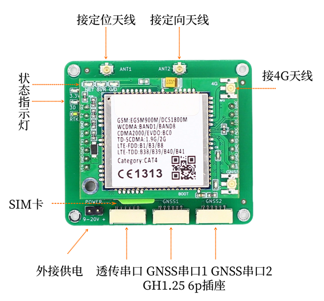
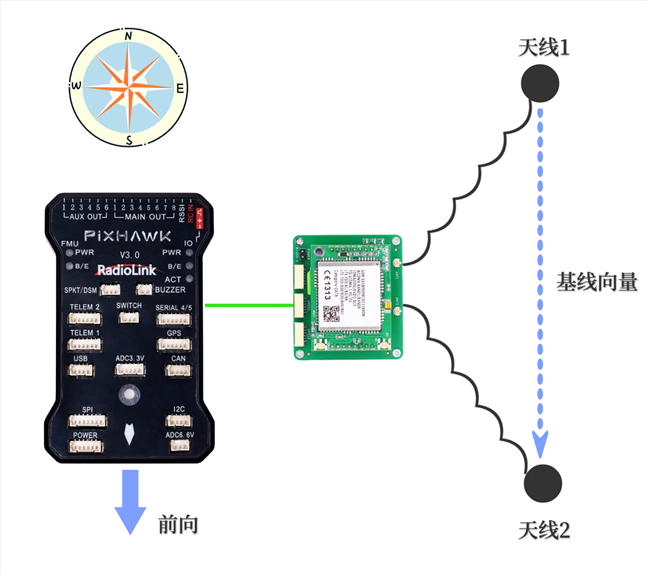
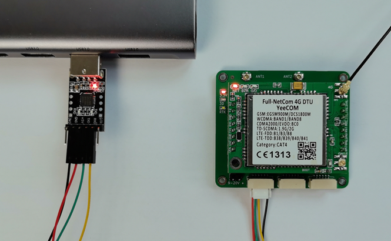
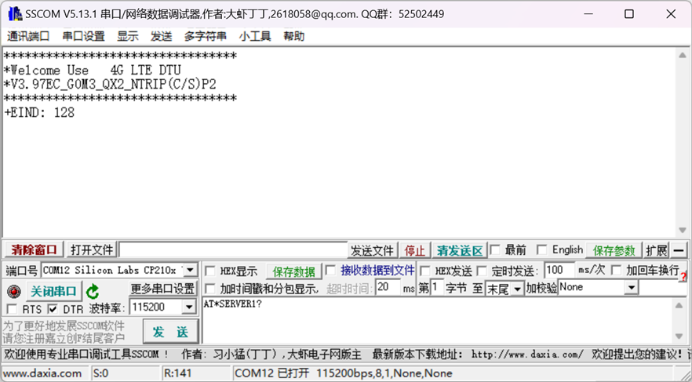

# B94板卡手册V1.2

## 1  简介  
&emsp;&emsp;B94模块为三频全系统高精度RTK定位定向模块，支持北斗，GPS，Glonass，伽利略以及QZSS导航系统。<br>
&emsp;&emsp;B94集成了全网通4G模块，内置NTRIP客户端，配置CORS账号后可直接连接千寻位置，六分科技，中移等第三方CORS服务，获取差分数据后进行RTK高精度定位。账号信息自动保存，上电自动连接。<br>
&emsp;&emsp;B94提供一个TTL UART透传接口，支持TCP/UDP协议，可将串口数据透传到云端服务器。在无人机/无人车应用中，可作为地面站和飞控的数传接口，即4G数传，在4G信号覆盖良好的地区，可以做到不限距离的遥测/遥控。<br>

!!! note "注意事项"

    1. 用户需自备SIM卡及相应的流量包，以保证正常上网。
    2. 用户需自备有效的CORS账号，以保证正常获取差分数据。
    3. 用户使用TTL透传数据需自备云端服务器IP地址（域名）及端口号，各种数据后台的服务器软件和应用控制软件开发技术众多，实现方式也非常多，请自行使用熟悉擅长的方式实现，我们不提供服务端技术开发支持服务，可以配合联调测试，请理解。<br>
    4. 如对板卡参数配置不熟悉，可在发货前提供CORS账号及云端服务器IP/端口号，我们可帮助进行参数配置并联网测试验证。所有参数配置后会自动保存，板卡上电后自动连接。到货后只需用户插入SIM卡即可正常工作。
 
主要指标如下图所示。

|参数|性能指标|
|--|--|
|GNSS 接收频点|GPS: L1/L2/L5<br>BDS: B1I/B2I/B3I<br>GLONASS L1/L2<br>Galileo: E1/E5a/E5b<br>QZSS L1/L2/L5|
|GNSS UART 波特率|默认115200 8N1 可配其它波特率|
|数据更新率 (Hz)|1Hz, 5Hz,10Hz, 20Hz|
|GNSS UART协议|NMEA 0183 协议<br>RTCM 3.0/3.2/ MSM4 (收发)|
|定位精度|GNSS 3D 2.5m CEP 50<br>D-GNSS <1.0m CEP 50<br>RTK 1cm+1ppm(水平) <br>3cm+1ppm(垂直) |
|定向精度 Heading|0.2度/1m基线 |
|网络频段|GSM: 800M/900M<br>2G/3G/4G（自适应）<br>TD-SCDMA: B34/B39<br>LTE-FDD: B1/B3/B5/B8<br>LTE-TDD: B34/B38/B39/B40/B41<br>Category: CAT4|
|透传UART 波特率|默认115200 8N1 最高460800|
|透传网络协议|TCP/UDP 二选一|
|CORS访问|NTRIP协议|
|接口|2.54mm 2pin 单独供电（9-20V）<br>3个GH1.25mm 6Pin插座 UART+5V供电<br>4G天线 IPEX 1代<br>GNSS 定位，定向 2个 IPEX 1代 <br>SIM卡 Micro中卡|
|尺寸|57mm X 50mm X 18.5mm|
|工作电压|4.5V~5V GH1.25mm 6Pin插座（不可超过5.3V）<br>或外接9-20V单独供电 二选一|
|工作电流|5V下平均电流 300-350mA<br>峰值电流 800mA|

## 2  接口说明

{: .center-image }
 
 - SIM卡插座使用Micro卡，即中卡。访问CORS时每小时流量消耗为7M字节左右，如使用物联网卡，需根据自己的使用时长选择合适的流量套餐，避免流量超出无法上网。<br>
- GNSS天线接口，板上已设计3.3V供电电路，建议使用四臂螺旋天线或碟形天线，请注意天线需支持相应的频段。
- 4G全网通模块天线接口，外接4G天线。
- 状态指示灯分别为3.3V 红色，单点定位 绿色，RTK Fix 白色。Network 网络指示灯，Server 连接指示灯，Data 指示灯。
- GH1.25 6pin插座为供电及UART接口，共有3个，分别为透传数据，GNSS1及GNSS2接口。引脚定义如下。

  

 |引脚|定义|电平|
|--|--|--|
|1|VCC|MAX 5.3V|
|2|RXD收|3.3V|
|3|TXD发|3.3V|
|4|NC| - |
|5|NC| - |
|6|GND|GND| 

!!! note "注意"

    GNSS1口对应配置文件中COM1， GNSS2口对应配置文件中COM2，两个串口完全独立，可发送不同的消息类型及配置不同波特率。
 
## 3  工作流程

!!! note "注意"

    上电前请连接好GPS天线，4G天线，插入SIM卡，提前配置好CORS账号及透传数据的服务器IP/端口号，配置方法见后。

&emsp;&emsp;模块上电后会开始搜索卫星尝试定位，GNSS1/2口有NMEA数据输出。正常情况下上电1分钟左右3D定位成功，此时板上3D指示灯会亮起。同时4G模块会尝试连接网络，网络连接成功后Network 网络指示灯会对应闪烁。而后连接透传服务器，连接成功后Server 连接指示灯会常亮。同时也会连接CORS的服务器。<br>
&emsp;&emsp;模块在3D定位后会自动发送一个位置信息给CORS服务器，服务器收到位置信息后会开始下发差分数据，收到差分数据后模块自动开始RTK解算，正常情况下很快进入RTK fix状态，板上RTK指示灯会亮起。大多数CORS服务需要提供位置信息后才能下发差分数据，也就是需要等待板上3D指示灯亮起后才能收到差分数据。<br>
&emsp;&emsp;GNSS天线尽量保持在无遮挡环境，通常Rover会处在运动中，如果进入遮挡较多的地点，可能会退出RTK Fix状态。<br>
&emsp;&emsp;GNSS1接口默认输出GGA，RMC, HDT消息，默认刷新率10Hz。GNSS2口默认输出GGA消息，刷新率1Hz。如需其它消息或刷新率请联系我们。<br>
&emsp;&emsp;GNSS1通常连接飞控，GNSS2可通过线束直接连接到数据透传接口，从而将定位信息发回到用户服务器，实现远程监测和轨迹记录。<br> 
&emsp;&emsp;数据透传接口可连接任何UART（3.3V）接口，例如飞控的数传接口，从而建立双向通讯，实现地面站和飞控的远程连接。数据透传接口和CORS访问完全独立，不会互相影响。<br> 

## 4  双天线定向
&emsp;&emsp;B94支持双天线定向（Heading）功能，此航向信息完全由卫星导航系统计算得出，相比地磁传感技术，避免了大体积金属，地磁异常等引起的误差和干扰，也无需校准，可靠性更高，使用更方便。 
航向示意图如下：

{: .center-image } 

&emsp;&emsp;B94 ANT1定位天线与ANT2定向天线之间的基线向量，与真北方向逆时针的夹角。如图所示假设上北下南，那此时航向角为180度。<br> 
&emsp;&emsp;如果使用在无人机，无人车等场景，在安装天线时需要确保此向量与飞控“前向”方向一致，否则飞控软件计算的位置和航向会有错误。<br>
&emsp;&emsp;两个天线的水平直线距离称为基线长度，基线长度过小会影响航向角精度，因此在条件允许的情况下尽量使基线长度保持在40CM~60CM之间。<br>

## 5  4G模块配置及调试
&emsp;&emsp;4G模块的配置使用AT命令方式，用户需要配置CORS服务器及透传服务器的相关参数，请使用USB转TTL调试工具连接B94板卡的透传串口，然后使用串口助手发送相关AT命令。<br>
!!! note "注意"

    请避免使用CH340系列的USB转TTL模块，可能有串口兼容性问题导致无法收发数据。

{: .center-image }

&emsp;&emsp;串口助手推荐使用sscom，波特率115200 8 N 1，配置前请插入SIM卡，否则4G模块会定时重启，在重启过程中不能接收AT命令。<br>


!!! warning "注意"
    1. 所有配置命令必须为纯英文字符，配置时请确认输入法为英文，中文输入法输入的字符会导致错误。
    2. 所有的AT命令必须以‘回车换行’结束。在sscom中可勾选右下角的“加回车换行”自动添加。

{: .center-image }

### 1.	配置CORS服务器
```bash
命令格式：
配置：AT*SERVER1=0,addr,port#
查询：AT*SERVER1?

返回：
OK
ERROR
+SERVER1:0,addr,port

参数说明:
<addr>：服务器地址，域名或IP，推荐用 IP
<port>：服务器端口

举例：
AT*SERVER1=0,rtk.ntrip.qxwz.com,8002# //配置连接千寻的域名+端口
```
### 2.	配置用户名、密码、挂载点
```bash
命令格式：
配置：AT*NTRIP=username,password,mountpoint#
查询：AT*NTRIP?

参数说明:
<username>：用户名；
<password>：密码；
<mountpoint>：挂载点；

举例：
AT*NTRIP=qxautp004,2f15xxx,AUTO#  //千寻通常使用AUTO挂载点
```
### 3.	配置串口透传服务器IP/端口号
```bash
命令格式：
配置：AT*SERVER2=connect type,addr,port#
查询：AT*SERVER2?

返回：
OK
ERROR
+SERVER2:0,addr,port

参数说明:
<connect type>: 协议类型，0为TCP，1为UDP
<addr>：服务器地址，域名或IP，推荐用 IP
<port>：服务器端口

举例：
AT*SERVER2=0,88.88.88.88,5760# //连接服务器88.88.88.88的5760端口，TCP协议
```
### 4.	配置透传串口波特率
```bash
命令格式：
配置：AT*UART=baudrate,databits,parity,stopbits,flowcontrol#
查询：AT*UART？

返回：
OK
ERROR
+UART:115200,8,0,1,0

参数说明:
<baudrate>: 波特率，支持9600, 19200, 38400, 57600, 115200, 230400, 460800, 921600，默认115200
< databits >：数据位，固定8bit
< parity >：校验位，0无校验，1奇校验，2偶校验，默认无校验
< stopbits >：停止位，固定为1
< flowcontrol >：串口流控，0无流控，1硬件流控，2软件流控，默认0无流控

举例：
AT*UART=115200,8,0,1,0# /配置串口波特率115200，8bit数据，无校验，1停止位，无流控
```
### 5.	重启4G模块
```bash
命令格式：
配置：AT*RESTART#
收到此命令约20秒后，4G数传模块会重启。
```
### 6 	串口调试信息
配置好参数，重新上电后，透传串口会打印状态信息，如下
```bash
*********************************
*Welcome Use   4G LTE DTU
*V3.97EC_G0M3_QX2_NTRIP(C/S)
*********************************
+EIND: 128
+CSIM: PBK Ready
OK
+CSIM: SMS Ready   //设备注册入网成功
```
如果正常配置完成后无法RTK定位，或者无法透传串口数据到后台服务器，则配置中某些参数有错，请联系我们提供远程调试服务。
!!! note "注意"
    所有AT命令的参数部分，用户需自行保证正确无误，板卡无法判断是否正确。建议配置完成后立即使用查询命令核对参数是否正确写入。
## 6  常见问题及解决方法
### 1.	供电
&emsp;&emsp;B94可通过3个GH1.25 6pin插座中的任何一个提供5V供电，也可通过独立供电插座提供9V-20V的供电。供电之间有隔离，不会串流。无论通过哪种供电，电源必须能够提供0.8A的峰值供电能力，即使B94平均电流只有0.35A左右。<br>
&emsp;&emsp;在进行4G模块参数配置时，通常使用的USB转TTL模块连接电脑，5V供电也由此模块提供。在这种情况下可以进行参数配置，但是可能无法连接4G网络，因为电脑的USB口通常只能提供0.5A的供电能力，因此在配置好参数后请确认供电电源不是电脑的USB口。<br>
&emsp;&emsp;Pixhawk飞控通常可以通过GH1.25 6pin插座提供1.5A的供电能力，如果遇到4G网络不能连接的情况，请从分电板或电池直接供电。
### 2.	天线
&emsp;&emsp;B94的GNSS天线要求支持相应的频段，通常情况下要求全频天线或双频天线。注意如果天线不支持某一频段，则B94也无法接收对应频段的信号。<br>
&emsp;&emsp;如果天线确认无误，请检查天线周边是否有遮挡，具体说明请参照第3节内容。通常天线架设在窗边或者半边高楼遮挡的环境会导致B94一直处于3D定位状态，无法进入RTK fix，即使NTRIP服务器访问正常并已收到差分数据。因此初次测试时请尽量选择开阔环境，先确认板卡工作正常。<br>
<br>
&emsp;前往淘宝店选购：[淘宝店铺](https://shop571754683.taobao.com/){:target="_blank"}
&emsp;&emsp;&emsp;&emsp;&emsp;&emsp;&emsp;&emsp;&emsp;
前往B站查看教程：[Bilibili](https://space.bilibili.com/1105134755){:target="_blank"}<br>
  **欢迎扫码访问**  
