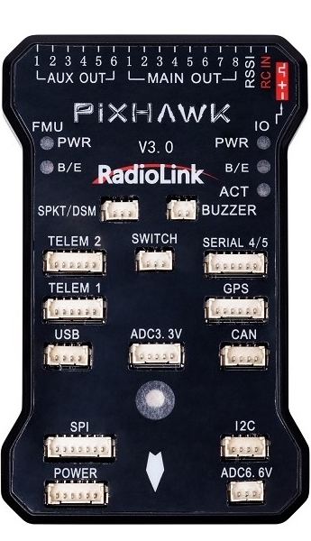
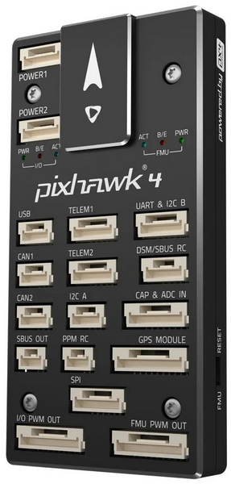
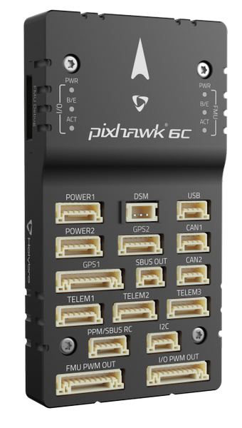

# 支持的飞控
&emsp;&emsp;Ardupilot和PX4是最流行的2种开源飞控软件，都支持多旋翼，固定翼等多种无人机模式。对应的官方地面站软件分别为MissionPlanner和QGC。 
&emsp;&emsp;常见的飞控硬件为Pix2.4.8，Pix4，Pix6c，这个系列的飞控硬件也是开源的，由PX4定义标准并开发。这系列的硬件通常支持Ardupilot和PX4飞控软件，用户可以自行选择刷机。 

!!! note "关于官方固件"

    &emsp;&emsp;对上述的两种飞控软件的**官方固件**，我们板卡通过大量测试验证可用。但是对于二次开发的**非官方固件**，即飞控厂商提供的固件，因二次开发通常会裁剪代码，无法保证能使用。 
    &emsp;&emsp;**官方固件**指通过**MissionPlanner**或**QGC**地面站软件在线升级的固件，或者在**官方网站**下载的固件文件，本地刷入飞控。

## Pix2.4.8

## Pix4

## Pix6c

## 其它飞控硬件
&emsp;&emsp;如果您的飞控不是这3种，可以到Ardupilot和PX4的官方网站查询，看是否支持刷入这两种飞控软件。 
 
点击下方链接进入官网查询： 
[Ardupilot支持硬件列表](https://ardupilot.org/copter/docs/common-autopilots.html#open-hardware){:target="_blank"} 
[PX4支持硬件列表](https://docs.px4.io/main/en/flight_controller/autopilot_pixhawk_standard.html){:target="_blank"} 

&emsp;前往淘宝店选购：[淘宝店铺](https://shop571754683.taobao.com/){:target="_blank"}
&emsp;&emsp;&emsp;&emsp;&emsp;&emsp;&emsp;&emsp;&emsp;
前往B站查看教程：[Bilibili](https://space.bilibili.com/1105134755){:target="_blank"} 
  **欢迎扫码访问**  
