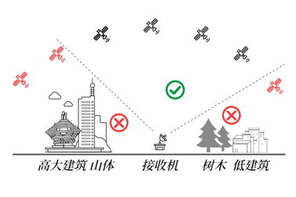
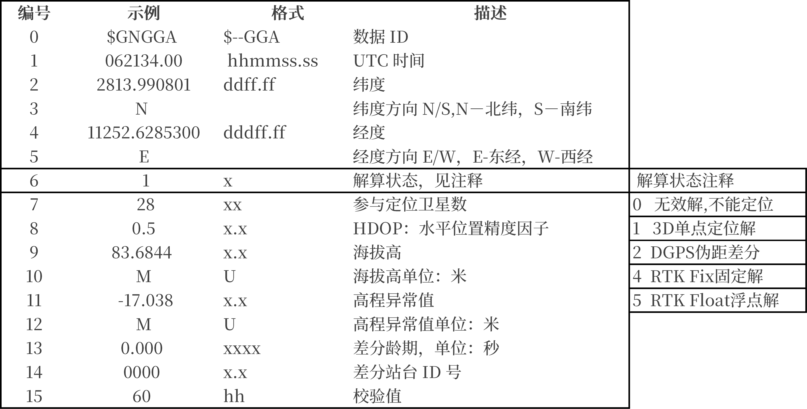
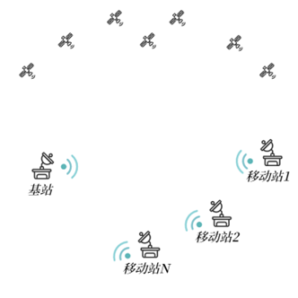

# 通用注意事项

## 环境遮挡
&emsp;&emsp;地面接收到的卫星信号非常微弱，因此建筑物，树木，金属物体（含金属成分的玻璃，布料等），人体的遮挡都会影响卫星信号的接收，进而影响RTK fix固定解的比例。严重的遮挡会造成无法达到固定解，即厘米级的精度。下图是遮挡的示意图。 

 
&emsp;&emsp;完全无遮挡的环境即为地平面夹角15度以上，水平360度范围内都可直视天空，无障碍物。
&emsp;&emsp;因此在地面上测试时，应尽量选在区域的最高点（如屋顶），或者选择在空旷的地方（如操场）。如果以上条件都不具备，那么设法将GNSS天线架高（三脚架），避免人体的遮挡影响。 
&emsp;&emsp;对于自建基站，如B92，B80，B72的基站模式，因基站需固定不动，尽可能放置在制高点上。 
&emsp;&emsp;对于移动站，通常安装在设备上并处于运动中，无法避免周围环境的遮挡，因此需将GNSS的天线置于设备的最高点，避免设备本身的遮挡。 

## 精度说明
&emsp;&emsp;Rover模式下，视使用环境和差分数据状态，移动站输出的经纬度位置精度可能会变化，同时在NMEA消息的GGA语句中会体现出来，以下对各种状态说明。 
 

 

- 3D单点定位：理论精度2.5米，实际精度5米到几十米。移动站如果不使用差分服务，或者在使用过程中差分数据中断，也会退回到这个状态。 
- DGPS伪距差分：理论精度0.5米，实际精度0.5米到十几米。 
- RTK Float浮点解：理论精度20厘米，实际精度20厘米到1米。 
- RTK Fixed固定解：理论精度2厘米，实际精度2厘米到5厘米。 
&emsp;上述的状态变化为软件自动，用户只需要保证环境尽量开阔，数传频点无干扰（自建基站场景），RTK Fixed固定解的比例就会高。反之如果固定解比例低，请检查GNSS天线是否连接好，数传频点是否有干扰。 

## 1拖N组网
&emsp;&emsp;使用自建基站如如B92，B80，B72时，一个自建基站在板载数传电台的覆盖范围内（无遮挡可直视情况下3公里左右）可支持N个移动站，即无限数量。基站到移动站的差分数据为单向广播模式。 
 

 

!!! warning "自建基站注意"

    移动站在任意时刻只能接收唯一一个基站的差分数据，因自建基站采用广播模式，因此在上面示意图中不能有第二个或更多的基站，否则多个基站的广播会互相干扰，导致移动站无法正常接收差分数据。
 
&emsp;前往淘宝店选购：[淘宝店铺](https://shop571754683.taobao.com/){:target="_blank"}
&emsp;&emsp;&emsp;&emsp;&emsp;&emsp;&emsp;&emsp;&emsp;
前往B站查看教程：[Bilibili](https://space.bilibili.com/1105134755){:target="_blank"} 
  **欢迎扫码访问**  
