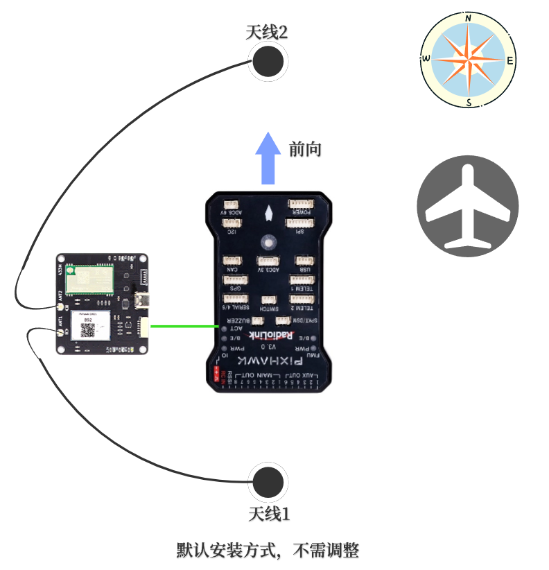
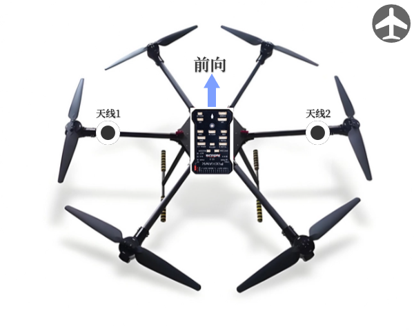
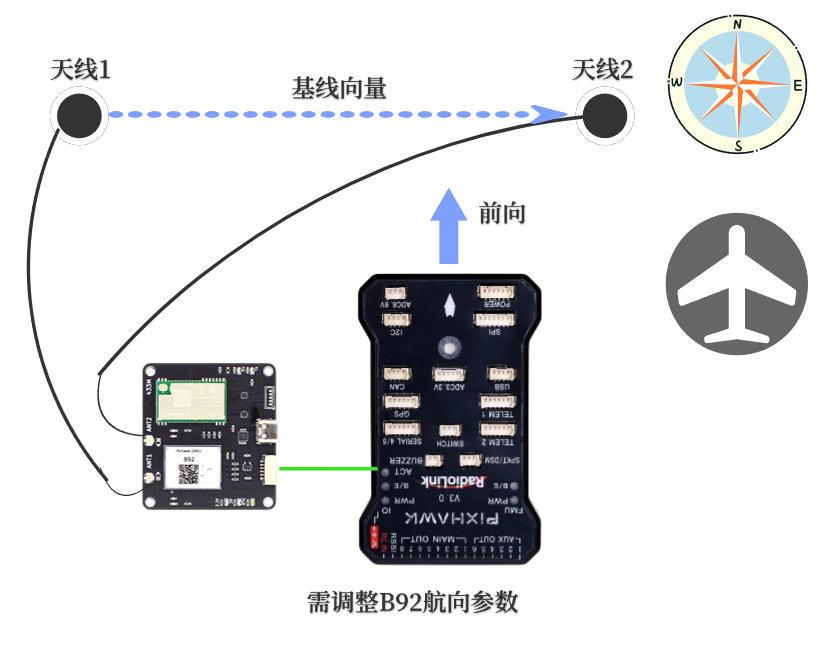
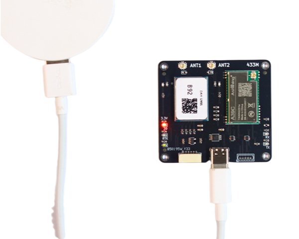
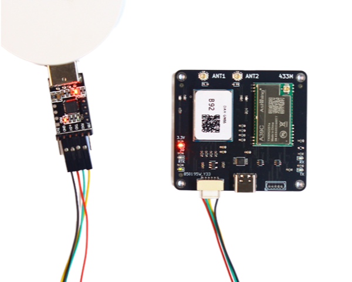
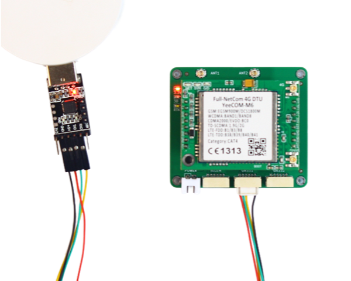
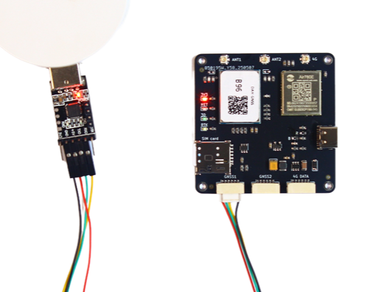
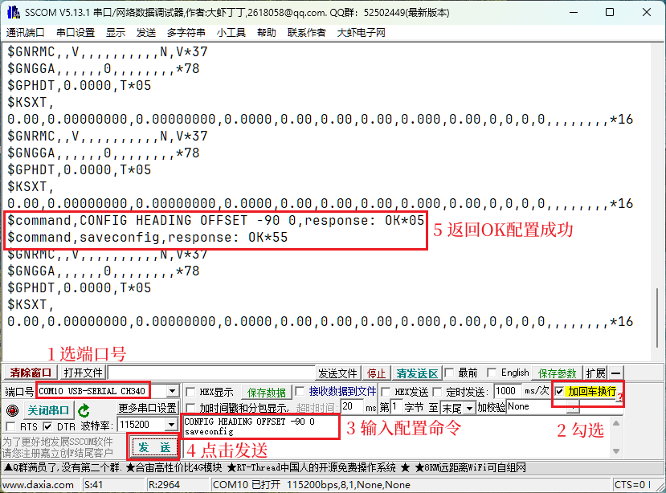

# 双天线定向配置

## 默认航向
&emsp;&emsp;B92（Rover移动站模式），B94，B96三款板卡支持双天线定向（Heading）功能，此航向信息完全由卫星导航系统计算得出，相比地磁传感技术，避免了大体积金属，地磁异常等引起的误差和干扰，也无需校准，可靠性更高，使用更方便。<br>
&emsp;&emsp;以B92为例，板卡默认航向示意图如下：
 
{: .center-image }

&emsp;&emsp;B92 ANT1定位天线与ANT2定向天线之间的基线向量，与真北方向逆时针的夹角。如上图所示假设上北下南，那此时航向角为0度，飞控此时的航向角也为0度，不需额外调整参数。<br>

## 更改默认航向
&emsp;&emsp;下图是六轴多旋翼的例子，在这种机架上，双天线无法安装在飞控的前后轴线上，只能安装在左右轴线上。<br>

{: .center-image }

&emsp;&emsp;对应的航向示意图如下：

{: .center-image }

&emsp;&emsp;此时需要更改B92，B94，B96的默认航向配置。<br>

!!! note "基线长度"
    两个天线的水平直线距离称为基线长度，基线长度过小会影响航向角精度，因此在条件允许的情况下尽量使基线长度大于40CM。

## 硬件连接

!!! note "只需连接电脑"
    配置时不需连接天线和飞控，只需将板卡连接至电脑的USB口即可。

### B92
&emsp;&emsp;B92既可以使用Type C数据线（推荐）连接，也可以通过USB-TTL的模块连接白色插座。如下面图示。<br>

{: .center-image }

{: .center-image }

### B94
&emsp;&emsp;B94通过USB-TTL的模块连接中间的白色插座。如下面图示。<br>

{: .center-image }

### B96
&emsp;&emsp;B96通过USB-TTL的模块连接左边的白色插座。如下面图示。<br>

{: .center-image }

## 串口助手配置
&emsp;&emsp;请按照上面六轴多旋翼图示安装**天线1**和**天线2**以及**飞控**，确认无误。<br>
&emsp;&emsp;以串口助手sscom为例，按照下图中所示的顺序操作即可。使用其它串口助手操作类似。<br>

{: .center-image }

&emsp;&emsp;至上图中第5步则配置成功。只需配置一次即可，板卡自动保存。<br>
&emsp;&emsp;配置命令如下：
```bash
CONFIG HEADING OFFSET -90 0
saveconfig
```
!!! note "注意"
    1. 所有字符为纯英文字符，勿使用中文字符。
    2. 两行命令后面都有回车换行（不可见），建议使用串口助手自带的**加回车换**行功能。

<br>
&emsp;前往淘宝店选购：[淘宝店铺](https://shop571754683.taobao.com/){:target="_blank"}
&emsp;&emsp;&emsp;&emsp;&emsp;&emsp;&emsp;&emsp;&emsp;
前往B站查看教程：[Bilibili](https://space.bilibili.com/1105134755){:target="_blank"}<br>
  **欢迎扫码访问**  
