# Mission Planner操作手册

## 1	准备工作
&emsp;&emsp;感谢您选用我们的导航板卡，我们的板卡适用于Ardupilot固件+Pixhawk硬件（或衍生硬件）组成的飞控平台，提供高精度的定位（定向）数据。具体指标请参考对应板卡手册。<br>
&emsp;&emsp;本文档对需要在MissionPlaner地面站中进行的操作进行了说明。<br>
&emsp;&emsp;在开始配置前，请准备好下列物品：<br>

- 导航板卡。<br>  
- Pixhawk兼容飞控硬件，固件建议使用官方正式版本。<br>
- 差分服务账号，千寻位置，六分科技等。或自建基站，如B50，B72，B80，B94或B92。<br>

!!! note "关于FMU V2"
    &emsp;&emsp;早期的Pixhawk飞控FMU V2版本因Flash空间为1M，在适配飞控固件时裁剪了相关代码，因此在某些较新固件版本（如4.3.x）上RTK定位或定向功能无法正常工作，请避免使用FMU V2版本的飞控。<br>
    FMU V3，V4，V5，V6版本飞控都可正常使用。
 
## 3	硬件连接
&emsp;&emsp;以Pixhawk 6C，B92为例，下图为连接飞控GPS1示意图。<br>
 
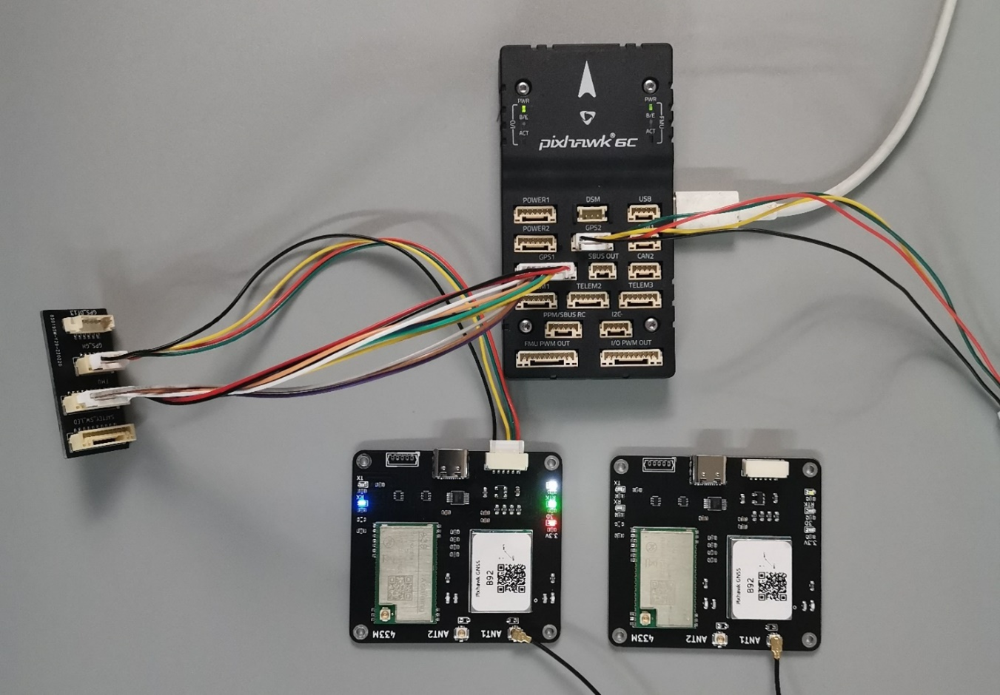{: .center-image }

&emsp;&emsp;Pixhawk 6C的GPS 1 接口集成了安全开关，LED功能，如希望继续使用安全开关，LED功能，通过一个转接板连接，转接板说明如下图。此转接板断开了原装GPS的串口，连接了B92板卡的串口。<br>

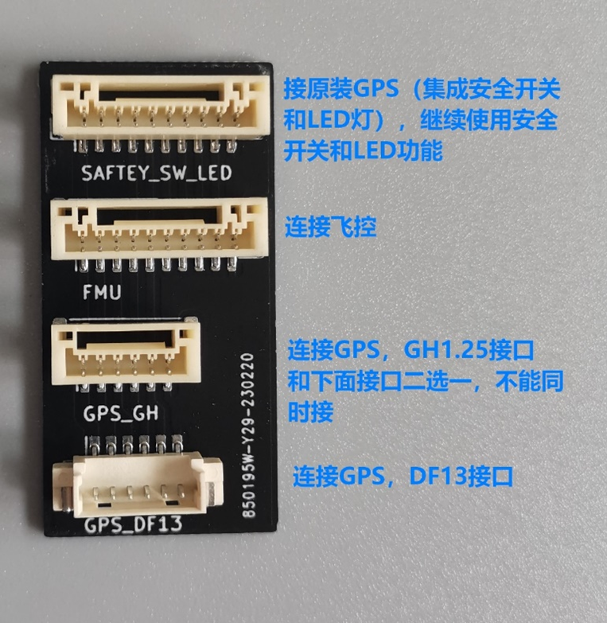{: .center-image }
 
&emsp;&emsp;我们所有板卡的GH1.25接口都参照Pixhawk4/6的接口定义设计，这两种飞控可使用板卡附带的线束直插连接，不需要用户调整线序。<br>
&emsp;&emsp;下图为Pixhawk4/6的接口定义和我公司板卡接口定义。<br>

 

|引脚|Pixhawk4/6定义|板卡定义|
|--|--|--|
|①|VCC 5V输出|VCC 5V输入|
|②|TXD发|RXD收|
|③|RXD收|TXD发|
|④|SCL|空|
|⑤|SDA|空|
|⑥|GND|GND|

&emsp;&emsp;如使用其它飞控，请自行确认或调整线序符合上图中的对应关系，特别注意飞控的TX接板卡的RX，飞控的RX接板卡的TX。<br>
&emsp;&emsp;以Pixhawk 6C，B92为例，下图为连接飞控GPS2示意图。<br>

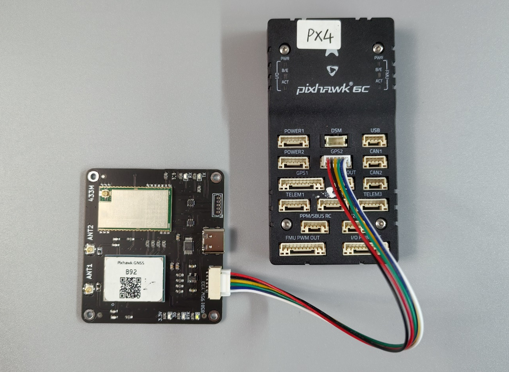{: .center-image }

&emsp;&emsp;以Pixhawk2.4.8，B92为例，下图为连接飞控GPS1示意图。<br>

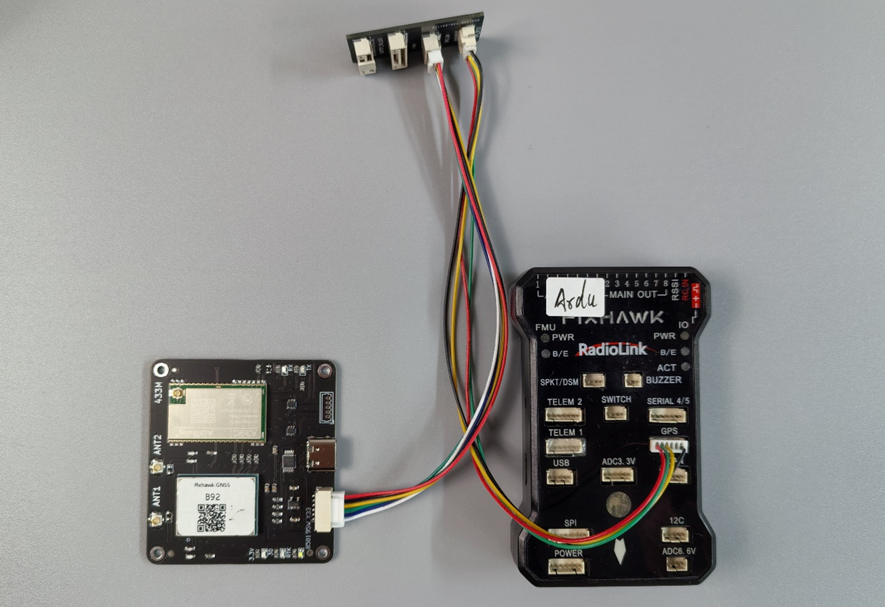{: .center-image }
 
## 4	第三方差分服务（Ntrip连接）
&emsp;&emsp;以千寻位置为例，您需要用户名，密码，以及服务器地址（域名），端口号（port），挂接点（MountPoint）等信息，这些信息在下一步MissionPlaner的配置中将要用到。如果不清楚，可到您的服务商网站登录后查看。其它差分服务商与千寻类似。

{: .center-image }

!!! note "激活账号"
    使用前请确认差分账号已激活，差分账号和密码不是千寻网站的登录账号和密码。
 
## 5	自建基站
 &emsp;&emsp;如使用B50作为自建基站，请将B50通过USB串口或蓝牙串口连接电脑。注意B50从上电到输出差分数据需要3分钟左右，请提前准备好。更详细资料请参考B50使用手册。<br>
&emsp;&emsp;如果使用B72，B80，B92作为自建基站，则不需要连接电脑。差分数据通过集成的数传模块直接发送到飞机端的对应板卡。 
## 6	Mission Planer配置
### 1.	MP修改参数
&emsp;&emsp;这里以修改GPS_TYPE参数为例做步骤说明，其它参数的修改操作步骤相同。<br>
&emsp;&emsp;将您的Pixhawk和电脑连接，打开MP，选择正确的端口后点击连接。<br>
 
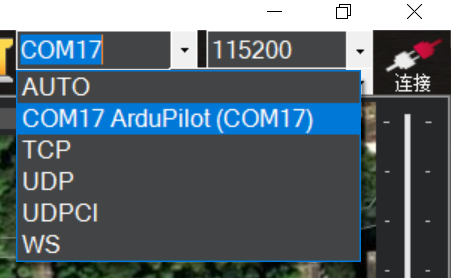{: .center-image }

&emsp;&emsp;依次点击**配置/调试**-->**全部参数表**<br>

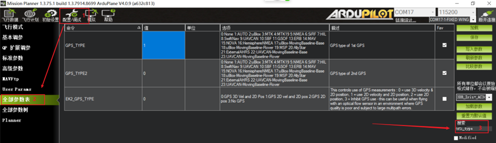{: .center-image }

&emsp;&emsp;在搜索框中输入**GPS_TYPE**后出现以下界面

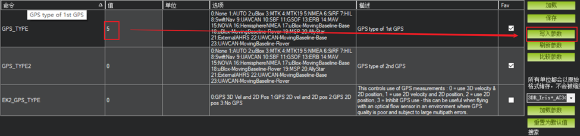{: .center-image }
 
&emsp;&emsp;双击上图中蓝色的位置，键盘输入将**1**改为**5**，然后点击**写入参数**
 
{: .center-image }

&emsp;&emsp;点击**好的**确认
 
&emsp;&emsp;出现下面窗口参数写入成功。

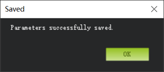{: .center-image }

!!! note "说明" 
    此配置只需执行一次，参数已保存在飞控板EEPROM上，即使掉电也无影响，后续使用无需再次配置。

&emsp;&emsp;点击**飞行数据**返回以下界面

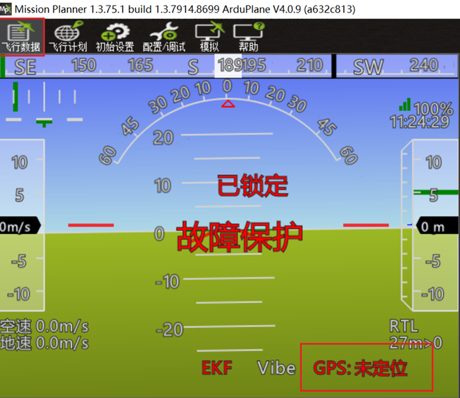{: .center-image }
 
&emsp;&emsp;此时可以看到GPS显示为未定位，表示飞控已经正确识别导航模块，只是未定位状态。
请将GPS天线移至窗边或户外。稍等片刻即可看到下图所示。

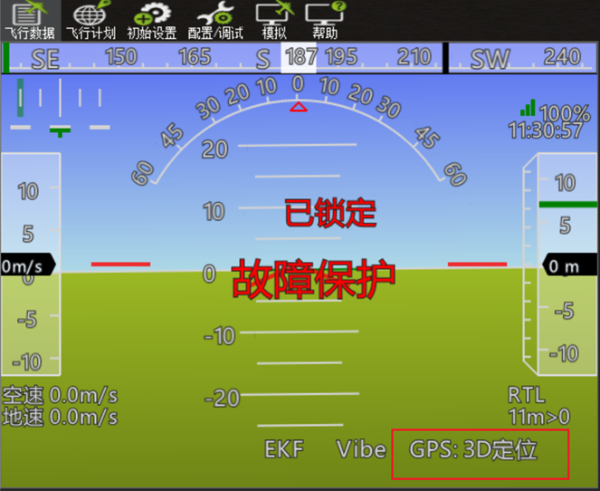{: .center-image }
 
&emsp;&emsp;此时已定位。

### 2.	连接差分数据

!!! note "注意" 
    仅在使用CORS或B50自建基站需要此操作，使用B72/B80/B92等自建基站时请跳过此节。<br>
    在下一步操作前请确认上图中GPS已处于3D定位状态，否则有可能会出错。

&emsp;&emsp;点击**初始设置-->可选硬件-->RTK/GPS Inject**来到以下界面

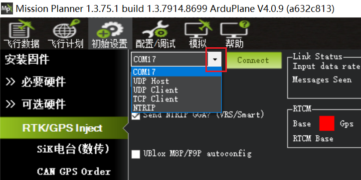{: .center-image }
 
&emsp;&emsp;如使用B50，点击红框中的下拉箭头选择B50对应的端口**COM**<br>
&emsp;&emsp;如使用CORS第三方差分服务，点击红框中的下拉箭头选择**NTRIP**<br>

{: .center-image }
 
&emsp;&emsp;然后点击**Connect** ，出现以下窗口。

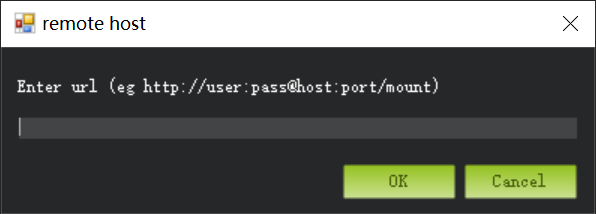{: .center-image }

!!! note "使用CORS" 
    此时您的电脑需要连接互联网，以便访问差分服务的服务器。
 
&emsp;&emsp;此处需要输入您的差分服务账号信息，格式为：
```bash
http://用户名:密码@服务器域名:端口/挂载点
```
&emsp;&emsp;以千寻位置为例：
```bash
http://用户名:密码@rtk.ntrip.qxwz.com:8002/AUTO
```
&emsp;&emsp;其它CORS服务商的依次类推，对应填入即可。

!!! note "8002" 
    端口号对应不同的参考坐标系，所有的导航模块默认为WGS84，请选择8002端口，选择其它端口号不能正常工作。

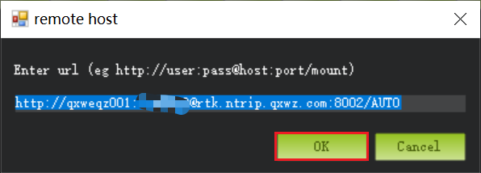{: .center-image }

&emsp;&emsp;点击**OK**<br>
&emsp;&emsp;出现以下界面表示差分服务连接成功。如果出现错误请确认CORS账号是否有效，电脑是否能连网。
使用B50在选择正确的端口COM并连接后会直接出现下面界面。

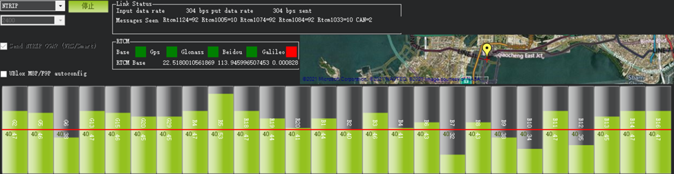{: .center-image }
 
&emsp;&emsp;如果点击连接后MP中没有出现上图的绿色柱子，也没有反应，请检查是否设置了起始位置。

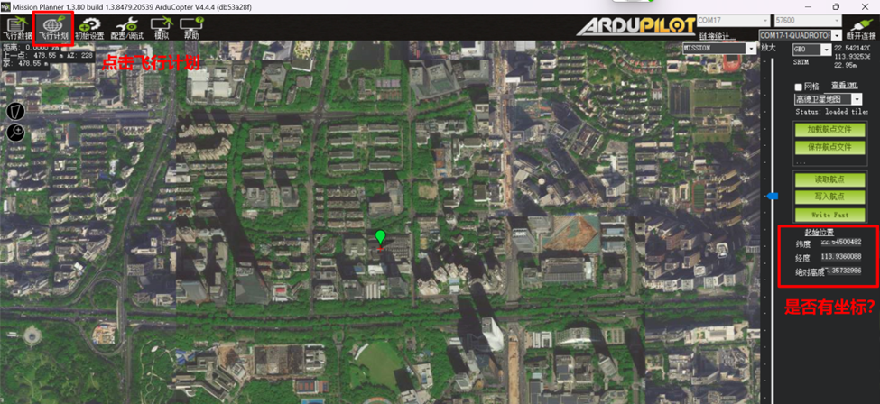{: .center-image }
 
&emsp;&emsp;如果起始位置下面坐标为空，请在飞控GPS处于3D定位的状态下点击一下起始位置。

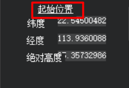{: .center-image }
                
&emsp;&emsp;回到连接CORS界面，点击 **Connect**，此时应出现上图中绿色柱子图，表示B50自建基站或CORS服务已连接成功。

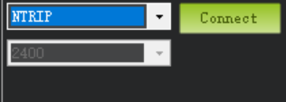{: .center-image }

&emsp;&emsp;再次点击**飞行数据**回到下图界面

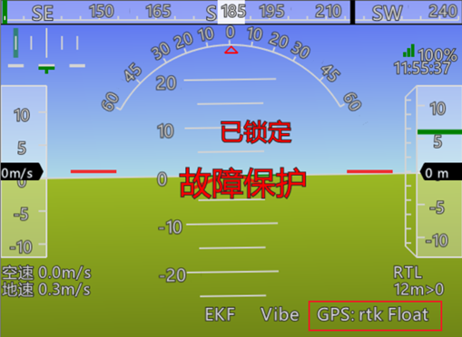{: .center-image }
 
&emsp;&emsp;图中红框表示导航模块已进入RTK Float状态，至此配置步骤全部完成。如要达到rtk Fixed状态请确保处于开阔无遮挡环境。<br>
 
### 3.  查看GPS原始数据

&emsp;&emsp;在MP主界面下按**Ctrl+F**键，出现如下窗口。

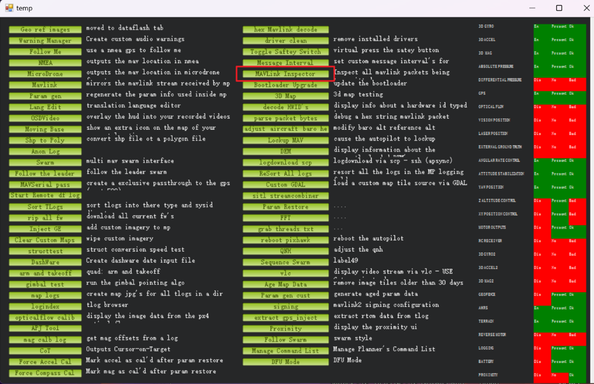{: .center-image }

&emsp;&emsp;点击红框中的**MAVLink Inspector**按钮，出现如下窗口。

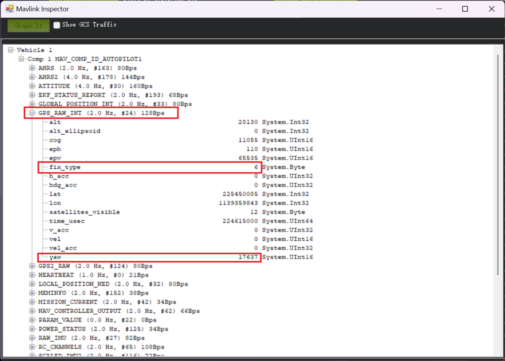{: .center-image }

&emsp;&emsp;红框中即为GPS的原始数据，如果板卡连接在飞控GPS2接口上，则查看**GPS2_RAW**。

!!! note "刷新率"
    上图红框中显示2.0Hz（刷新率）为MP软件bug，不影响正常使用。

## 7	板卡对应参数

&emsp;&emsp;不同型号的板卡在Mission Planner中需要修改的参数不完全相同，请点击下面的型号标签查看需要修改的参数列表。
=== "R20,R50,B72,B74"
        GPS_TYPE        5
        SERIAL3_BAUD    115
        GPS_RATE_MS     200 (5Hz刷新率)
=== "B80,B84"
        GPS_TYPE         5
        SERIAL3_BAUD     115
        GPS_RATE_MS      100 (10Hz刷新率)
        GPS_AUTO_CONFIG  0 （不自动配置）
=== "B92,B94,B96"
        GPS_TYPE         5
        SERIAL3_BAUD     115
        GPS_RATE_MS      100 （10Hz刷新率）
        GPS_AUTO_CONFIG  0 （不自动配置）
        AHRS_EKF_TYPE    3
        EK3_ENABLE       1 
        EK3_MAG_CAL      5 
        EK3_SRC1_YAW     2
        COMPASS_ENABLE   0
        COMPASS_USE      0
        COMPASS_USE2     0
        COMPASS_USE3     0

!!! note "GPS1 or GPS2?"
    &emsp;&emsp;以上参数为假设板卡连接在Pixhawk的**GPS1**插座上，如果连接在**GPS2/UART4**插座上，
    则参数对应如下，其它参数不变。<br>
    GPS_TYPE2 <br>
    SERIAL4_BAUD <br>
    GPS_RATE_MS2 <br>

&emsp;&emsp;如果连接飞控的其它接口，请查阅飞控硬件说明及Ardupilot参数表确定对应参数。<br>
&emsp;&emsp;上述参数对Ardupilot的不同固件Rover，Plane，Copter都适用，请确保固件版本在V4.1.0以上，推荐使用最新稳定版固件。全部参数修改完成后建议Pixhawk重新上电一次。

!!! warning "Bug1"
    &emsp;&emsp;如使用B80，B84，B92，B94，B96请使用飞控固件版本**4.4.0**以上。**4.4.0**之前版本有bug，RTK固定解有可能无法正确识别，并且HUD界面显示无GPS。但3D定位识别及显示正常。

!!! warning "Bug2"   
    &emsp;&emsp;当使用**GPS2**接口时，不要将 GPS_TYPE 设为0来**禁用GPS1**，某些固件版本有bug，重启后无法正确识别GPS2。如果GPS1不存在或为普通精度，飞控会自动使用精度高的GPS2工作。

<br>
&emsp;前往淘宝店选购：[淘宝店铺](https://shop571754683.taobao.com/){:target="_blank"}
&emsp;&emsp;&emsp;&emsp;&emsp;&emsp;&emsp;&emsp;&emsp;
前往B站查看教程：[Bilibili](https://space.bilibili.com/1105134755){:target="_blank"}<br>
  **欢迎扫码访问**  
