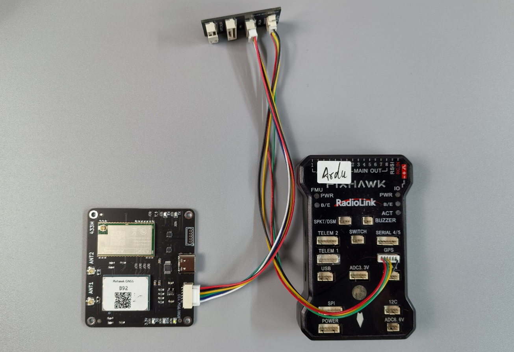

# QGC操作手册

## 1	准备工作
&emsp;&emsp;感谢您选用我们的导航板卡，我们的板卡适用于PX4固件+Pixhawk硬件（或衍生硬件）组成的飞控平台，提供高精度的定位（定向）数据。具体指标请参考对应板卡手册。 
&emsp;&emsp;本文档对需要在QGC地面站中进行的操作进行了说明。 
&emsp;&emsp;在开始配置前，请准备好下列物品： 

- 导航板卡。 
- Pixhawk兼容飞控硬件，固件建议使用官方最新正式版本。 
- QGC地面站软件，建议使用官方最新正式版本。 

## 2	PX4+QGC已知问题
### 使用CORS
&emsp;&emsp;截至QGC地面站V4.2.4版本，PX4固件1.13.2版本，QGC地面站软件未提供Ntrip服务端功能，无法直接使用第三方CORS服务。如果确实需要使用CORS，有两种方法： 
&emsp;&emsp;a. 选用B94，B84，B74，B96板卡，这些板卡集成了4G模块，可直接访问CORS，不再需要地面站访问CORS。 
&emsp;&emsp;b. 使用MAVProxy软件，具体方法请联系我们。 
### 使用B50+R50/R20组合
&emsp;&emsp;QGC也不提供标准RTCM转发功能，即无法使用B50+R50/R20组合的方案。在这种情况下，R50，R20可以在飞控端使用，但是无法做RTK高精度定位，只能提供普通精度的定位坐标。 
&emsp;&emsp;如要实现RTK高精度定位，请选用B72，B80，B90，B92等集成数传的定位板卡，并使用自建基站。 
### 使用双GPS
&emsp;&emsp;PX4固件可使用双GPS输入，但是默认飞控上电时GPS1必须连接。如果GPS1未连接，即使GPS2连接正常，也无法正确识别定位。因此在调试PX4时如果只有一个GPS，请接入GPS1接口。如果要调试GPS2接口，请保证GPS1接口也连接了另外一个GPS模块。 

!!! note "Ardupilot+Missonplaner"
    Ardupilot固件+Missonplaner地面站软件不存在上述限制，大部分飞控硬件都可以刷两种固件，请根据需要选择。

## 3	硬件
以Pixhawk 6C，B92为例，下图为连接飞控GPS1示意图。
 
{: .center-image }

&emsp;&emsp;Pixhawk 6C的GPS 1 接口集成了安全开关，LED功能，如希望继续使用安全开关，LED功能，通过一个转接板连接，转接板说明如下图。此转接板断开了原装GPS的串口，连接了B92板卡的串口。

{: .center-image }
 
 &emsp;&emsp;我们所有板卡的GH1.25接口都参照Pixhawk4/6的接口定义设计，这两种飞控可使用板卡附带的线束直插连接，不需要用户调整线序。 
&emsp;&emsp;下图为Pixhawk4/6的接口定义和我公司板卡接口定义。 

 

|引脚|Pixhawk4/6定义|板卡定义|
|--|--|--|
|①|VCC 5V输出|VCC 5V输入|
|②|TXD发|RXD收|
|③|RXD收|TXD发|
|④|SCL|空|
|⑤|SDA|空|
|⑥|GND|GND|

&emsp;&emsp;如使用其它飞控，请自行确认或调整线序符合上图中的对应关系，特别注意飞控的TX接板卡的RX，飞控的RX接板卡的TX。 
&emsp;&emsp;以Pixhawk 6C，B92为例，下图为连接飞控GPS2示意图。 

{: .center-image }

&emsp;&emsp;以Pixhawk2.4.8，B92为例，下图为连接飞控GPS1示意图。 

{: .center-image }
 
## 4	QGC参数修改
### 1.	查看QGC版本

{: .center-image }
  
### 2.	查看飞控固件版本

{: .center-image }
 
### 3.	修改GPS接口协议

{: .center-image }
 
&emsp;&emsp;点击右上角保存后按提示确认重启飞控。 

{: .center-image }
 
&emsp;&emsp;GPS 2的修改同GPS 1。如果GPS 1使用原装GPS，则只修改GPS 2. 
&emsp;&emsp;回到主界面，可看到已正确识别GPS。 
 
{: .center-image } 

### 4. GPS详细数据查看

{: .center-image } 
 
&emsp;&emsp;同时连接2个GPS时： 

{: .center-image } 
 
&emsp;&emsp;查看fix_type的值可确认GPS的定位状态，数值定义如下： 

{: .center-image } 
 
### 5. 使用双GPS
&emsp;&emsp;更改参数**SENS_GPS_MASK**。 

{: .center-image } 

### 6. GPS状态栏
&emsp;&emsp;因为QGC地面站中文版本的Bug，在下面界面中不会显示RTK定位状态而是显示为空，如需要显示，需将QGC的语言切换为英文，即可正常显示。 

{: .center-image } 
 
&emsp;&emsp;更换语言版本，更换后需重启QGC。 

{: .center-image } 

&emsp;&emsp;英文版中正常显示。 

{: .center-image } 
{: .center-image }  
  
### 7.	航向Heading
&emsp;&emsp;B92，B94，B96板卡提供了双天线定向功能，可以提供给飞控一个准确的航向，相比磁罗盘，GPS航向不受干扰，更准确。 
&emsp;&emsp;双天线定向功能和RTK高精度定位功能无关，即使定位状态为3D定位，航向信息也是准确的。 
&emsp;&emsp;PX4固件**1.13.X**中使用 **EKF2_AID_MASK**参数。 

{: .center-image } 
 
&emsp;&emsp;PX4固件**1.14.X**中使用 **EKF2_GPS_CTRL**参数，**EKF2_AID_MASK**参数不再使用。 

{: .center-image } 

{: .center-image } 
  
&emsp;&emsp;此时可看到飞控的航向和GPS的航向一致，如果单独转动飞控，飞控的航向会变化，但是几秒钟后会回到GPS航向，这是因为飞控使用了IMU，磁罗盘和GPS航向的融合数据。 

{: .center-image } 

&emsp;&emsp;上图的效果是在双天线和飞控的相对位置如下图所示的前提下 

{: .center-image } 

&emsp;&emsp;如无法按图中相对位置安装（例如六轴多旋翼），则需要修改板卡参数。请参见相关说明。 

 
&emsp;前往淘宝店选购：[淘宝店铺](https://shop571754683.taobao.com/){:target="_blank"}
&emsp;&emsp;&emsp;&emsp;&emsp;&emsp;&emsp;&emsp;&emsp;
前往B站查看教程：[Bilibili](https://space.bilibili.com/1105134755){:target="_blank"} 
  **欢迎扫码访问**  
