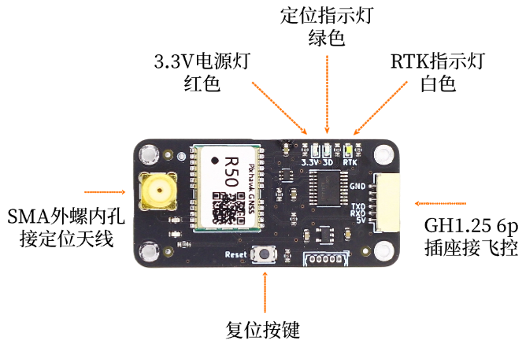
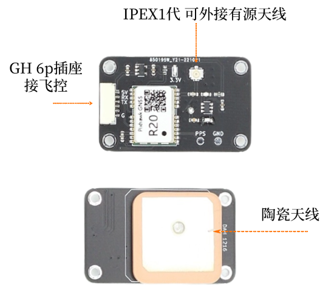
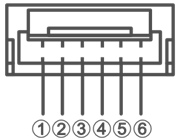
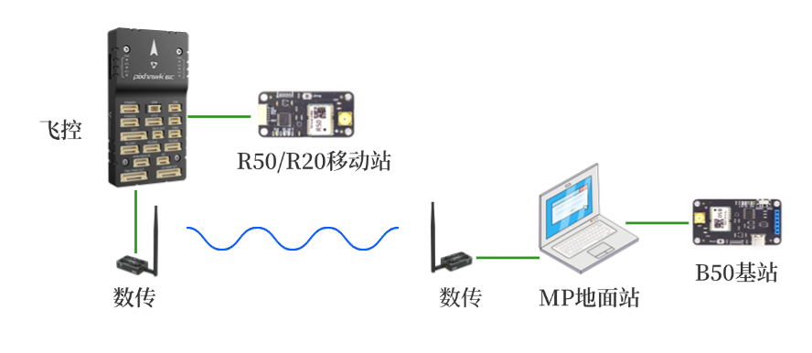
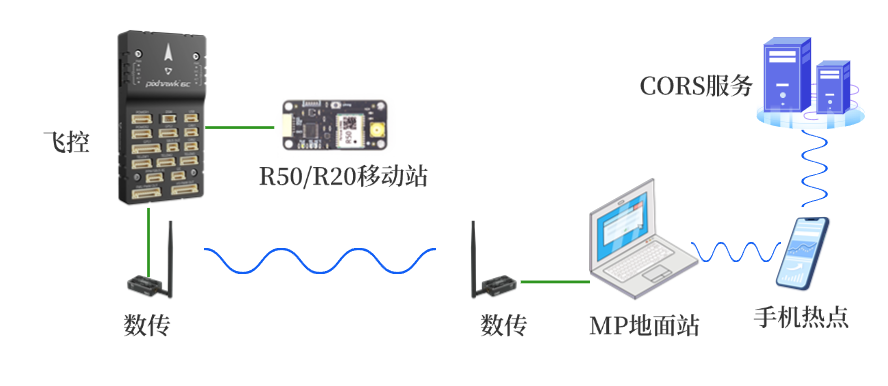

# R50、R20板卡手册

&emsp;点击链接观看视频：[R50 B50快速安装](https://www.bilibili.com/video/BV1EUEszaE8u){:target="_blank"}

## 1	简介
&emsp;&emsp;R50模块为**双频**三系统高精度RTK模块，支持北斗3代，GPS以及伽利略导航系统。 
&emsp;&emsp;R20模块为**单频**三系统高精度RTK模块，支持北斗3代，GPS以及伽利略导航系统。 
主要指标如下图所示。
  
| 参数  | R50 （双频） | R20 （单频）|
|------|--------|--------|
| GNSS 接收频点  | GPS/QZSS: L1C/A, L5 BDS: B1I, B2a Galileo: E1, E5a  | GPS/QZSS: L1C/A BDS: B1I Galileo: E1  |
| UART 波特率  | 115200 8N1   | 115200 8N1  |
| 数据更新率 (Hz) |5Hz| 5Hz |
| 定位精度  | GNSS 3D 2.5m CEP 50 D-GNSS <1.0m CEP 50 RTK 2cm+1ppm(水平) 6.5cm+1ppm(垂直) | GNSS 3D 2.5m CEP 50 D-GNSS <1.0m CEP 50 RTK 2cm+1ppm(水平) 6.5cm+1ppm(垂直)  |
|天线|外接四臂螺旋|内置陶瓷|
| 接口  | GH1.25 6pin SMA 母 GNSS  | GH1.25 6pin IPEX 1代 GNSS |
| 协议  | NMEA 0183 协议 4.00/4.10 版本 RTCM 3.0/3.2/ MSM4 (收发) MSM7 (仅收) | NMEA 0183 协议 4.00/4.10 版本 RTCM 3.0/3.2/ MSM4 (收发) MSM7 (仅收) |
| 尺寸 | 50mm × 24mm | 43mm × 26mm  |

!!! note "主要区别"
    &emsp;&emsp;R20和R50在RTK固定解的情况下都能达到厘米级精度，区别在于R20为单频，要求天空完全开阔无遮挡，并且进入RTK固定解的时间较长。R50则允许天空有部分遮挡，并且进入RTK固定解的时间较快。

&emsp;&emsp;总体而言，R20的固定解比例远低于R50，仅建议作为入门学习，样机验证等等用途。在对定位精度和稳定性要求高的产品中，请选用R50，或其它双频，三频模块。 

## 2	接口说明
 
R50接口 

{: .center-image }
 
R20接口 

{: .center-image }

- R50板上SMA为天线接口，板上已设计3.3V供电电路，建议使用四臂螺旋天线或碟形天线，请注意天线需支持L1 L5频段。 
- R20板上已有陶瓷天线，使用时请保证陶瓷天线指向天空。也可以外接其它增益更高的有源天线，外接其它天线的情况下请将板上陶瓷天线指向地面。 
- GH1.25插座为供电，UART接口，在Rover模式下接收差分数据，发送NMEA数据，在Base模式下发送差分数据。引脚定义如下。
 
   

   |引脚|定义|电平|
  |--|--|--|
  |1|VCC|MAX 5.3V|
  |2|RXD收|3.3V|
  |3|TXD发|3.3V|
  |4|NC| - |
  |5|NC| - |
  |6|GND|GND|  
 
- R50板上设计了指示灯，以显示当前定位模式，具体定义如下：
  
   
| 模式   | 3D 绿色          | RTK 白色         | 定位状态                          |
|--------|-------------------|------------------|-----------------------------------|
| Rover  | 灭 亮 亮 亮 | 灭 灭 闪 亮 | 未定位 3D单点定位 RTK浮动解 RTK固定解 |

## 3	Rover模式
&emsp;&emsp;R50和R20仅支持Rover移动站模式。 
&emsp;&emsp;Rover模式下如需RTK精确定位，需要将基站差分数据通过串口发送给R50/R20，R50/R20会自动解算。基站差分数据可以来自自建基站（B50 Base模式），也可以来自第三方的CORS服务商，例如千寻位置，六分科技，中移位置等。此时需要在Base和Rover之间有数据链路进行通讯。第三方的CORS服务商通常提供互联网方式访问，可选NTRIP协议或SDK方式。自建基站通常采用数传电台，也可视实际传输距离考虑其它通讯方式，通讯带宽不能低于19200波特率。 
&emsp;&emsp;Rover模式下天线尽量保持在无遮挡环境，通常Rover会处在运动中，如果进入遮挡较多的地点，可能会退出RTK Fix状态。 

&emsp;&emsp;无人机应用中通常配合B50基站模式使用，连接示意图如下。 

{: .center-image }
 
&emsp;&emsp;也可使用第三方的CORS服务，连接示意图如下。 

{: .center-image }

 
&emsp;前往淘宝店选购：[淘宝店铺](https://shop571754683.taobao.com/){:target="_blank"}
&emsp;&emsp;&emsp;&emsp;&emsp;&emsp;&emsp;&emsp;&emsp;
前往B站查看教程：[Bilibili](https://space.bilibili.com/1105134755){:target="_blank"} 
  **欢迎扫码访问**  
