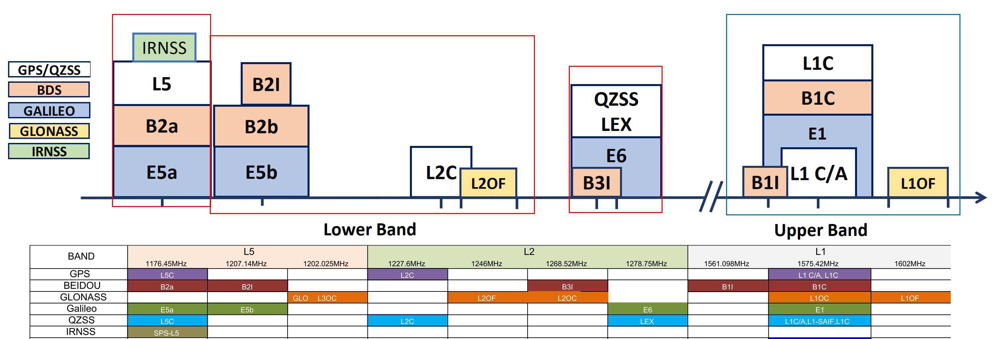
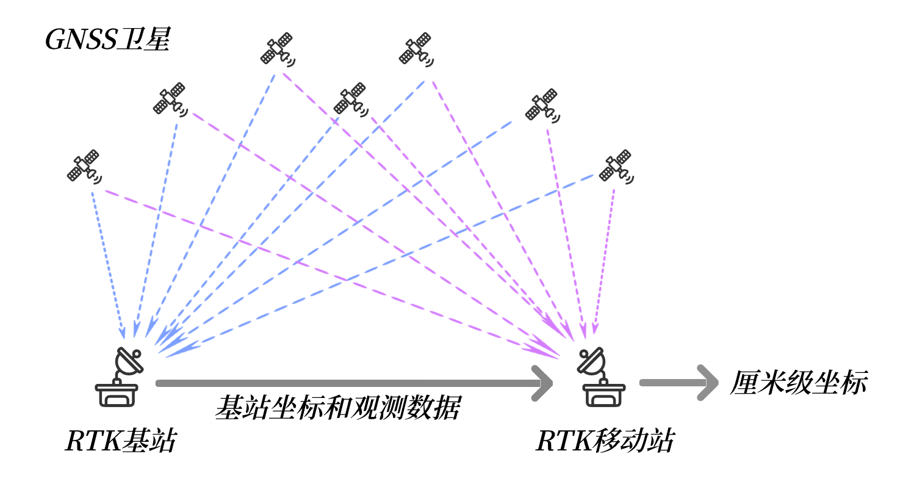

# RTK原理讲解

## 基本概念一：RTK也是GPS
&emsp;&emsp;RTK是在普通卫星定位基础上的一种增强技术，并不是另外一套技术体系。因此RTK板卡在没有接收到差分数据的时候，就是一个普通的GPS（GPS是习惯用语，毕竟是最早实现的，现在严谨的叫法是GNSS），和常见的飞控配套的几十块钱的GPS模块没有差别。在收到基站的差分数据后（先不管怎么来的），RTK板卡会结合自身收到的卫星信号和基站来的差分数据，运行一些高深莫测的算法，算出一个厘米级的经纬度坐标。
## 基本概念二：卫星系统和频段
&emsp;&emsp;上面提到GPS是一个习惯用语，因为阿美利卡最早实现了这套系统并且在相当长时间内也是唯一的，而这套系统的的官方名称简写就是GPS。所以时间长了叫习惯了，即使有了其它系统，比如中国的北斗BDS，俄罗斯的Glonass和欧盟的伽利略，很多人还是叫GPS。但是现在绝大多数的接收机都是同时支持这几个系统的全部或者部分组合的，因此通常说GPS时并不是单指阿美利卡的GPS系统，而是指的所有卫星系统，即GNSS。 

&emsp;&emsp;通常看接收机或天线的介绍时，会看到类似“五模十频”的说法，其中五模的“模”就是指支持的卫星系统。目前实现全球覆盖的是四个系统：阿美利卡GPS，大鹅格洛纳斯Glonass，中国北斗BDS，欧盟伽利略Galileo（按建成时间排序），这四个系统都可以单独实现全球定位。第五模通常是指日本的区域系统QZSS，它不是全球覆盖的，也不能单独定位，可以理解为日本自己出钱建造发射了几颗和GPS高度兼容的卫星，保证在自己头顶永远有一两颗卫星，辅助GPS以改善定位效果。在我国的东部地区是可以接收到这些卫星信号的，卫星信号永远是多多益善。另外南边的三哥还是有点实力的，也搞了自己的区域系统IRNSS，理论上可以单独定位，覆盖南亚地区，算是第六模，只是能见到的支持IRNSS的产品极少，UP主没见过也没玩过，就不乱评论了。
下面说“五模十频”中的这个频，上面提到的所有系统的卫星都不止发射一个频段的信号，下图就是目前所有系统的民用信号频段汇总。  
 
{: .center-image } 
 
 
&emsp;&emsp;对RTK接收机来说，同时接收不同频段的信号可以改善卫星信号在电离层中非直线传播引起的误差，有点“兼听则明”的意思。当然处理的卫星系统和频段越多，对接收机的处理能力要求越高，实际上现在大多数的接收机内部都使用嵌入式的处理器，就是MCU。MCU的性能高了，芯片尺寸，功耗和成本也就上去了。早期的RTK接收机以板卡为主，就是因为专用的SOC比较少，集成度不高，有些板卡上能清楚的看到MCU+DSP+FPGA+RF的硬件架构。现在随着我国的造芯大潮，SOC方案越来越多，尺寸，功耗和成本就都下来了。当然这些不同的SOC方案就体现了各个厂家对应用场景，性能，市场容量，价格的一个综合考量，这点和任何电子产品都一样，一万块的手机和一千块的手机都有对应的用户群体，脱离了价格说A比B好没有任何意义，性价比才是关键。  

## 基本概念三：天线
&emsp;&emsp;接收机既然要接收卫星信号，就离不开卫星接收天线。按天线的材料和结构分主要有3种类型，陶瓷天线，四臂螺旋天线，测量天线（俗称蘑菇头）。强调一下天线和接收机是要匹配的，玩游戏的都知道，好显卡要配好显示器，好显示器也要配好显卡，RTK这里也是类似的。第一优先的就是频段的匹配，接收机支持的频段天线都要支持，这样才能发挥最好的性能。其它考量点还有天线增益，重量，尺寸，成本等等。优先推荐四臂螺旋天线，主要是尺寸小，重量轻，增益也足够，无人机上绝大多数都是这种。其次是蘑菇头天线，性能最好，但尺寸和重量都比较大，飞机上一般是没法用的。小尺寸的陶瓷天线不建议用，成本低是唯一的优点，好马配好鞍不废话。   
## 基本概念四：基站和移动站
&emsp;&emsp;下面这张图演示了最简单的RTK系统，一个基站（也是一个接收机）把观测到的卫星数据，通过某种通讯链路发送到移动站，移动站结合自身收到的卫星信号和基站来的数据，运行一些高深莫测的算法，算出一个厘米级的经纬度坐标。  
 
{: .center-image }
  
&emsp;&emsp;其中基站在工作过程中需要固定位置不能移动，并且需要把自己的经纬度坐标发送给移动站,基站的经纬度坐标越精准越好，基站准了移动站也就准了，基站就是移动站的标兵。 

&emsp;&emsp;移动站顾名思义通常是在运动中的，例如安装在车辆，无人机上等等。移动站能接收到的卫星信号基站最好也能全部接收到，也就是说移动站是“五模十频”的那么基站也是“五模十频”的，最理想的状态。实际应用中经常需要基站支持不同型号的移动站，那么简单的办法就是基站选用能接收全部系统和频段的型号，差分数据是大而全的，移动站可能需要的都包含在内。 
&emsp;&emsp;移动站是移动的，例如所安装的车辆在道路上行驶，那么周围的环境是不可控的，这里几栋高楼挡住了北边天空的卫星，那里几栋挡住了南边天空的卫星，因此基站最好能提供全部可见卫星的数据给移动站。基站的位置是固定的，因此选择一个制高点安装基站天线是通常的做法，例如某片区域内最高建筑物的楼顶。 

&emsp;&emsp;基站的数据如何传输到移动站通常根据工作区域的大小来确定，例如固定在一个2-3公里方圆的区域内，就可以使用数传电台，433M或者2.4G的自由频段都可以，整个系统非常简单。要在更大范围内工作，通常就需要使用移动互联网来传输，基站将卫星数据上传到一台服务器，移动端通过4G模块来实时的获取，同时也需要架设更多的基站，因为单个基站的观测数据有个有效的范围，通常是以基站为中心半径30-60公里。 
&emsp;&emsp;看到这里是不是就理解了千寻，六分等等CORS服务商是做什么的了？简单来讲它们的核心业务就是在全国范围内建设基站，然后实时提供数据给需要做RTK高精度定位的用户，收取费用。上面提到的几点要求：1.基站位置固定且自身坐标精确 2.接收所有可见卫星信号，卫星数据大而全，都是非常有保证的。当然这只是最简化的理解，实现起来牵涉到更多高深莫测的技术。 

## 基本概念五：刷新率 
&emsp;&emsp;刷新率就是移动站每秒能计算多少个点的经纬度坐标并输出。大多数的应用中安装移动站的设备是运动的，速度有快有慢，例如无人机在空中以120公里的时速飞一个S型机动，那么每秒就能跑出33.3米，如果此时移动站只能每秒输出1个点的位置，就是1Hz的话，那么就不能准确反应出这个S型的轨迹，看上去就是多段长度为33.3米的折线。因此运动速度越快需要的刷新率就越高，由此移动站处理性能就要高。根据应用中运动速度的高低选择合适的刷新率是用户需要考量的，通常的刷新率等级为1，2，5，10，20Hz。同时还要考虑对接的设备是否能够处理高的刷新率，尤其是在嵌入式的环境中。 

##  基本概念六：双天线定向
&emsp;&emsp;定向就是确定东西南北方向，几千年前我们祖先就发明了指南针并沿用至今，只是在形式上已经进化为芯片，原理应该都明白。但是地球磁场这东西是不稳定的，当你脚下土地中蕴含某些矿产，或者周围有较多的钢铁结构时，指南针这个东西就会受到干扰，误差会增大。 
&emsp;&emsp;如果在一张地图上告诉你两个点的位置，那么这两点连线的方向就显而易见了。上面提到在RTK系统中移动站相对基站的位置是准确的，达到了厘米级，那么移动站和基站之间连线的方向精度就可以非常高，只要这个连线的长度不要太短，一般大于0.4米就可以。当把基站和移动站同时放在一台车上，两个天线一头一尾，那么车头方向就等于这个连线的方向，通过实时计算这个连线的方向就得到了车的方向。在这种情况下基站的位置不是固定的，但不影响计算相对位置。 
&emsp;&emsp;上面是双天线定向的原理，实际看到的产品会把基站和移动站集成在一起，对定向来说，因为基站和移动站是同时在线的，所以高精度的方向是一直有的。通常会把这个定向的基站作为定位的移动站，同时接收一个外部固定基站的卫星数据，从而同时实现定位和定向。这个比单独的定位更复杂一些，因此成本就更高。 

&emsp;前往淘宝店选购：[淘宝店铺](https://shop571754683.taobao.com/){:target="_blank"}
&emsp;&emsp;&emsp;&emsp;&emsp;&emsp;&emsp;&emsp;&emsp;
前往B站查看教程：[Bilibili](https://space.bilibili.com/1105134755){:target="_blank"} 
  **欢迎扫码访问**  

