# W80板卡手册

## 1	简介
&emsp;&emsp;W80集成了RTK模块和2.4G WiFi模块，支持NTRIP Caster，NTRIP Client，NTRIP server模式，支持TCP/UDP Server和Client模式。RTK基站/移动站模式和不同协议可灵活组合，满足多种应用场景的需求。典型应用场景及对应的协议组合举例请跳至第7节。<br>
&emsp;&emsp;RTK模块为全系统全频，支持北斗，GPS，Glonass，伽利略以及QZSS导航系统的所有民用频段。模块可工作在Base基站或者Rover移动站模式，通过UART接口或者网络远程配置工作模式，配置命令可保存，再次上电可自动加载保存的工作模式及参数。<br>
&emsp;&emsp;支持千寻位置，六分科技，中移等第三方CORS服务。<br>
主要指标如下图所示。
 
|参数|性能指标|
|--|--|
|GNSS 接收频点|GPS: L1/L2/L5<br>BDS: B1I/B1C/B2I/B2a/B3I<br>GLONASS L1/L2<br>Galileo: E1/E5a/E5b<br>QZSS L1/L2/L5|
|UART 波特率|115200 8N1 可配其它波特率|
|数据更新率 (Hz)|1Hz, 5Hz, 10Hz, 20Hz|
|定位精度|GNSS 3D 2.5m CEP 50<br>D-GNSS <1.0m CEP 50<br>RTK 1cm+1ppm(水平)<br>3cm+1ppm(垂直)|
|接口|USB Type C供电 串口<br>GH1.25mm 6Pin插座<br>WiFi天线 SMA外螺内孔<br>GNSS天线  SMA外螺内孔|
|协议|NMEA 0183 协议<br>RTCM 3.0/3.2/ MSM4 (收发)|
|尺寸|64 X 64 X 57mm|
|重量|77克|
|工作电压|5V~24V （不可低于5V）|
|工作电流|250mA@5V，150mA@9V|

## 2	接口说明

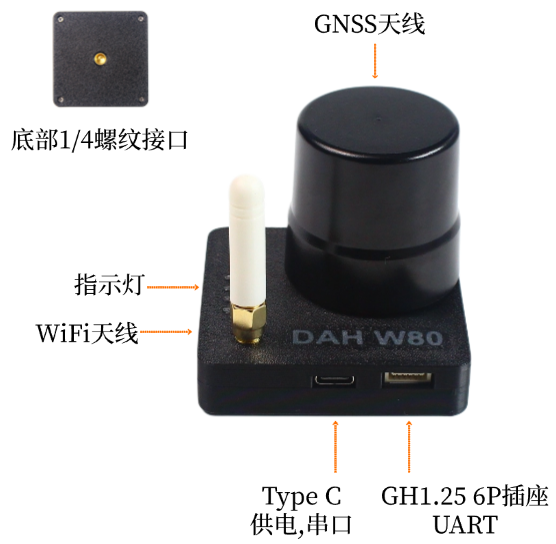{: .center-image }

- 状态指示灯分别为3.3V 红色，RTK Fix 白色，3D定位 绿色，工作模式指示灯 多色。
- Type C接口为供电及串口，使用USB数据线连接到电脑USB口，电脑会自动识别串口，可使用串口助手对W80的RTK模式进行配置。
- GH1.25 6pin插座为供电及UART接口，在Rover模式下发送NMEA数据，接收配置命令。引脚定义如下。
   
   
  
   |引脚|定义|电平|
  |--|--|--|
  |1|VCC|MAX 5.3V|
  |2|RXD收|3.3V|
  |3|TXD发|3.3V|
  |4|NC| - |
  |5|NC| - |
  |6|GND|GND| 
 
!!! note "注意"
    GH1.25 UART口对应配置文件中COM1， USB串口对应配置文件中COM3，两个串口完全独立，可发送不同的消息类型及配置不同波特率。
     
## 3	Base模式

&emsp;&emsp;Base模式和Rover模式通过内置的配置页面进行选择。<br>
&emsp;&emsp;如配置为Base模式，上电后会自动进入求坐标平均值模式（Survey In）并持续3分钟，3分钟后W80自动获取到一个固定坐标，可通过NTRIP Caster或TCP服务器输出RTCM差分数据：1005 (0.1Hz)，1074(1Hz)，1084(1Hz)，1094(1Hz)，1124(1Hz)，1114(1Hz)。此时其它W80移动站Rover，或者无人机遥控器可接收此差分数据进行RTK解算。<br>

!!! note "通用基站"
    &emsp;&emsp;W80支持目前所有卫星系统的所有民用频段，因此可作为通用的自建基站，支持多种型号的移动站。

&emsp;&emsp;Base的GNSS天线位置请尽量选择开阔无遮挡的环境，并且架设高度尽量高，可使用底部的1/4英寸云台快接口将W80放置在三脚架上。如果周围遮挡较多，可能会出现3分钟后W80仍然无法获得固定坐标，移动站只能3D定位，无法进行RTK解算。<br>
&emsp;&emsp;W80在大多数情况下可以允许有部分遮挡，这是多频模块的优点，但是最好不要超过三分之一的可视天空面积。<br>
 
!!! note "基站坐标"
    &emsp;&emsp;通过求坐标平均值方式获取的基站坐标并不是真正意义的精准坐标（厘米级），即使天线位置固定不动，每次重新上电或复位后获取的坐标会分布在半径约1.5米的圆内。移动站Rover在RTK Fix的状态下和基站Base的相对位置总是精确的，因此Base的绝对位置不准会导致移动站Rover绝对位置不准，但两者的偏差是一致的。在无人机，无人船等应用中如果只要求相对位置准确（如自动返航功能等），则可以不要求Base基站绝对位置准确。

&emsp;&emsp;如果需要移动站Rover绝对位置准确，则Base基站的绝对位置(天线位置)必须准确，您需要通过其它方法（如使用CORS）获取Base基站的准确的经纬度坐标，然后通过UART写入到W80中。经纬度坐标需要精确到小数点后第7位。<br>
```bash
配置命令示例：
//22.5450078 纬度 ；113.9359845 经度；28.17 高程
mode base 22.5450078 113.9359845 28.17 
//保存配置
saveconfig                                                    
```
## 4	Rover模式
&emsp;&emsp;如配置为Rover模式，上电后会立刻开始搜索卫星尝试定位，GH1.25或USB串口有NMEA数据输出，无RTCM消息。正常情况下上电1分钟左右3D定位成功，绿色3D指示灯亮。<br>
&emsp;&emsp;Rover模式下如需RTK精确定位，可使用自建基站，也可使用千寻，六分等第三方CORS服务，下面分别说明。<br>
&emsp;&emsp;自建基站方式需提前架设好另一台W80在Base模式，并打开NTRIP Caster或/和TCP服务器功能。W80 Rover端通过网页界面打开NTRIP Client功能或TCP客户端功能，配置好相应的IP/端口号后Rover会自动接收RTCM差分数据并解算。当进入RTK fix状态后，板上白色RTK指示灯会亮起。<br>
&emsp;&emsp;使用第三方CORS服务时，通过网页界面配置CORS账号，密码等等，同时所连接的WiFi网络应能够访问公网，W80会自动连接连接CORS，当进入RTK fix状态后，板上RTK指示灯会亮起。<br>
&emsp;&emsp;和Base模式相同，Rover模式下天线尽量保持在无遮挡环境，通常Rover会处在运动中，如果进入遮挡较多的地点，可能会退出RTK Fix状态。<br>
&emsp;&emsp;Rover移动站模式下UART接口默认输出GGA，RMC消息，默认刷新率5Hz，如需其它消息或刷新率请联系我们。<br>
 
## 5	WiFi网络
&emsp;&emsp;W80集成的WiFi模块仅支持2.4G频段，暂不支持5G频段。<br>
&emsp;&emsp;支持热点模式和设备模式。热点模式下可接入其它的W80或者WiFi设备，例如无人机的遥控器，手机等等。设备模式可接入现有的WiFi网络，需提前配置好接入的无线网络和密码等，重启后即可自动接入，实现多种功能。热点模式和设备模式可同时工作，可在配置页面内选择打开/关闭。一般不建议关闭热点模式。<br>
 
## 6	配置页面
&emsp;&emsp;第一次使用需要对W80进行相应的配置，主要为WiFi网络，NTRIP功能，TCP/UDP功能。所有的配置选项在提交后会自动保存，下次上电后会自动加载之前的配置。<br>
&emsp;&emsp;W80出厂默认打开了WiFi热点功能，上电后会出现一个名为“ESP_Xbee_xxxxxx”的网络，其中“xxxxxx”为一个随机产生的字母数字组合，每一个W80是唯一且固定的，在PC上点击WiFi连接，选择这个网络并连接。<br>
 
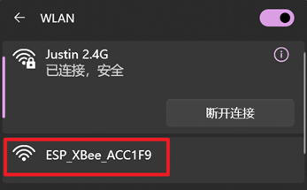 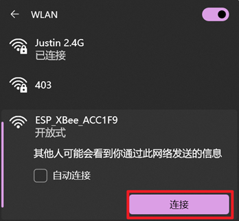 
 
&emsp;&emsp;连接成功后在PC上打开一个浏览器，在地址栏输入IP地址“192.168.4.1”，即可出现下图的配置页面。<br>
&emsp;&emsp;也可使用平板和手机进行操作同，只是选取WiFi网络的步骤不同，在此不再赘述。<br>

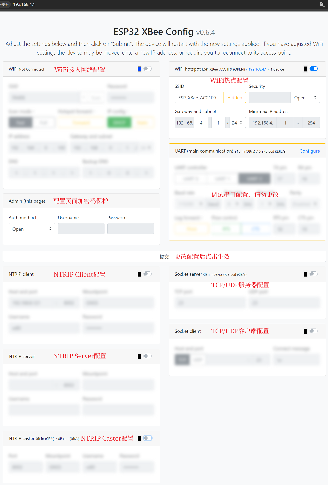  
 
&emsp;&emsp;配置页面中有多个不同的卡片，分别对应配置不同的功能，但基本的配置逻辑相同。配置完成后点击“提交”按钮，W80的WiFi模块会重启使得配置生效。请注意WiFi热点功能一般不要关闭，否则WiFi接入网络配置错误时（如WiFi接入点或密码错误），无法再访问配置页面来更改配置。<br>
&emsp;&emsp;第一次配置时，除热点功能外，其它的功能默认都是关闭的，卡片上的配置选项不可见。下面以配置WiFi网络为例进行说明。<br>

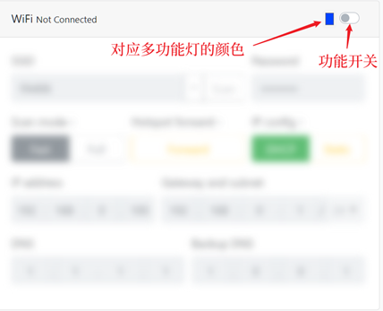{: .center-image } 
 
&emsp;&emsp;首先点击功能开关到右侧，所有配置内容即变得可见，点击“Scan”扫描周围可用的WiFi网络。<br>
 
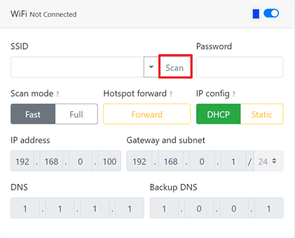{: .center-image } 
 
&emsp;&emsp;选取要连接的网络（图中以连接到Justin 2.4G网络为例），填入Justin 2.4G网络的WiFi的密码。其它的配置项保持不变即可。<br>

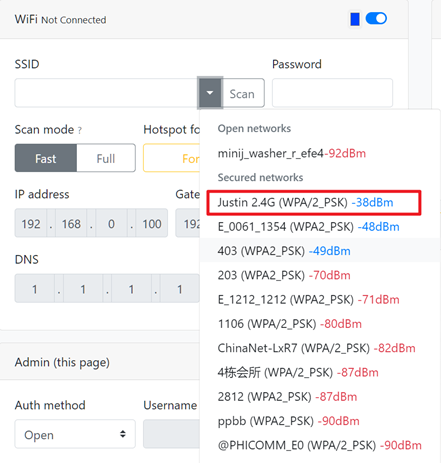{: .center-image } 
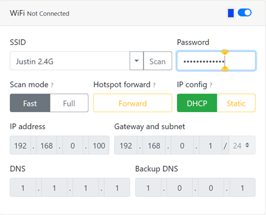{: .center-image }

&emsp;&emsp;每个功能模块可自定义一个颜色，此颜色将显示在W80的多功能指示灯上，用户可根据灯的显示快速判断此时哪一个或几个功能模块在工作中。如果选择黑色（默认），则代表不启用灯色指示功能。

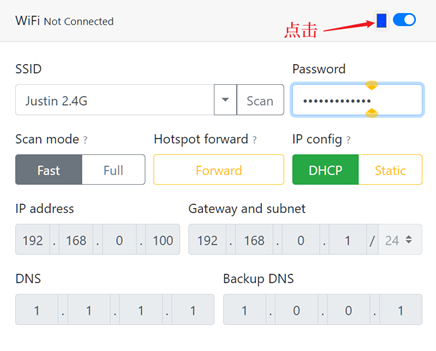{: .center-image } 
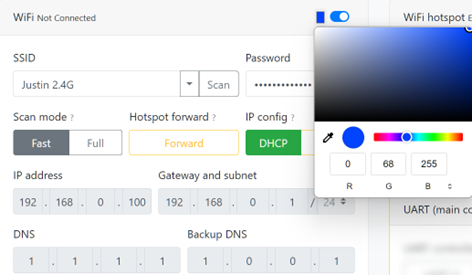{: .center-image } 
   
&emsp;&emsp;完成后点击“提交”按钮，再点击“Reload”按钮，WiFi模块将重启并使设置生效。

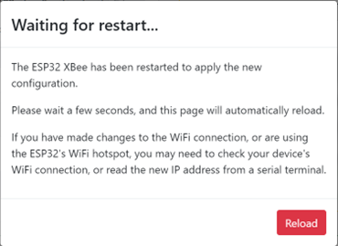{: .center-image } 
 
&emsp;&emsp;稍等片刻刷新页面（注意此时仍需要连接W80的Wifi热点，如果在W80重启过程中PC已连接到其它热点，请参照前面的步骤重新连接到W80的热点），可以看到W80已成功连接到Justin 2.4G网络并获取了IP地址。

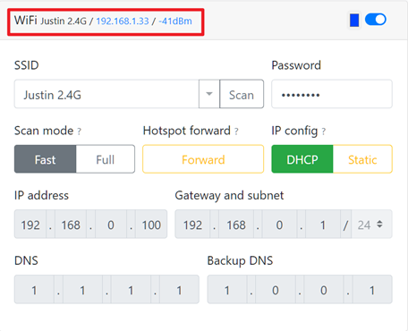{: .center-image } 
 
&emsp;&emsp;至此我们可以将PC重新连接回Justin 2.4G网络，并通过IP：192.168.1.33来访问配置页面，配置其它的功能选项。

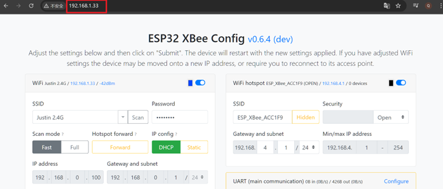{: .center-image }  
 
&emsp;&emsp;下面对其它各功能卡片的配置项做一个简要的说明。<br>
&emsp;&emsp;NTRIP Client配置：

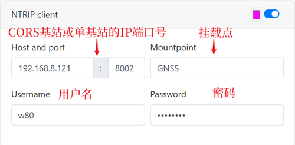{: .center-image } 

&emsp;&emsp;下面以中移动CORS账号为例，说明配置的内容

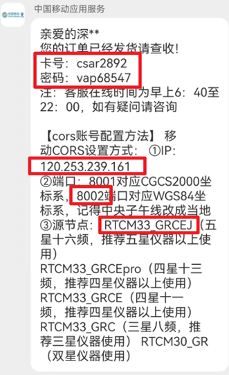{: .center-image } 
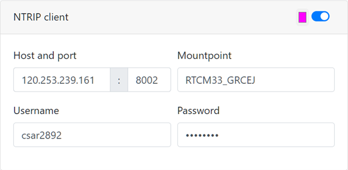{: .center-image } 
  
&emsp;&emsp;NTRIP Caster配置

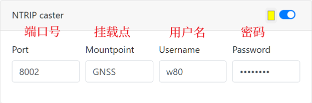{: .center-image } 
 
&emsp;&emsp;如果其它的NTRIP Client要连接这个Caster，就需要填入正确的配置项。<br>
&emsp;&emsp;TCP/UDP配置

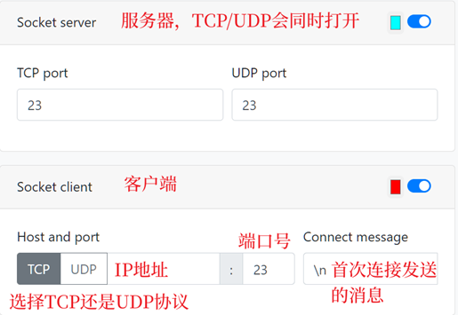{: .center-image } 
 
&emsp;&emsp;如果打开了TCP/UDP功能，可以通过网络远程获取定位信息GNGGA语句（Rover模式下），或者RTCM差分数据（Base模式下）。也可远程配置RTK模块，切换Base/Rover模式，或者配置UART/Type C串口输出的消息类型，刷新率等等。<br>

!!! note "注意"
    &emsp;&emsp;如需向后台服务器上报GGA语句，建议W80使用UDP客户端模式或者TCP服务器模式。不建议使用TCP客户端模式，TCP客户端模式下一旦WIFI网络出现重连接或者TCP目标服务器因意外关闭连接，则无法自动恢复，需要重新上电后才能再次连接。
 
## 7	典型应用场景
### 1  无人机自建基站
&emsp;&emsp;W80作为自建CORS基站，在手机信号覆盖较差的野外，为无人机遥控器充当CORS基站，例如DJI的行业系列无人机，Ardupilot开源飞控无人机等。只要带屏遥控器支持WiFi且内置的地面站软件支持访问CORS，就可以使用。<br>
### 2  固定场地内的基站和移动端
&emsp;&emsp;在固定场地内如有稳定的WiFi覆盖，例如工业园区或机器人实验场地，可使用W80作为基站和移动站，W80移动站在串口输出定位信息给机器人控制板的同时，还可以通过网络发送GNGGA定位消息给后台UDP服务器。或者后台采用TCP客户端，读取每个W80移动站的GNGGA消息。<br>
&emsp;&emsp;如果移动端的数量较多，超出了W80基站的带机能力，则需要另外设立NTRIP Caster服务器，将一个或多个W80配置为NTRIP Server模式，或TCP客户端，上传差分数据到NTRIP Caster服务器。其它的移动站连接NTRIP Caster服务器获取差分数据。<br>
### 3  定位信息实时采集
&emsp;&emsp;配置W80移动站连接手机热点，配置访问中移动或千寻的CORS服务，配置上传定位消息的服务器IP和端口号，即可实现定位信息的采集，上传。例如放置在车辆上，可实现高精度的车辆行驶轨迹上传。注意当车辆驶入高架桥下，隧道时，可能无法实现RTK高精度定位。<br>
<br>
&emsp;前往淘宝店选购：[淘宝店铺](https://shop571754683.taobao.com/){:target="_blank"}
&emsp;&emsp;&emsp;&emsp;&emsp;&emsp;&emsp;&emsp;&emsp;
前往B站查看教程：[Bilibili](https://space.bilibili.com/1105134755){:target="_blank"}<br>
  **欢迎扫码访问**  
